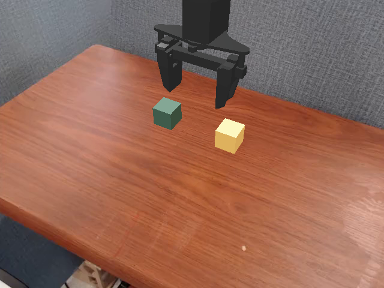
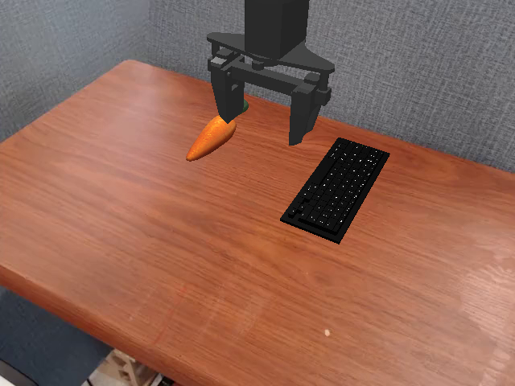
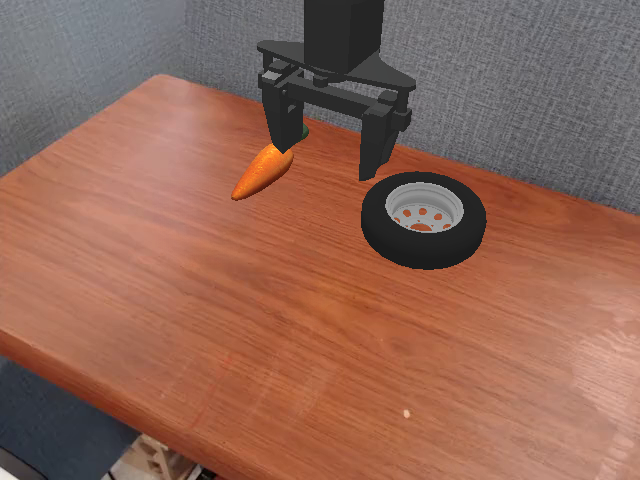
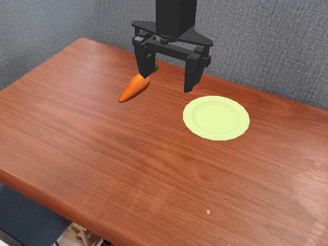
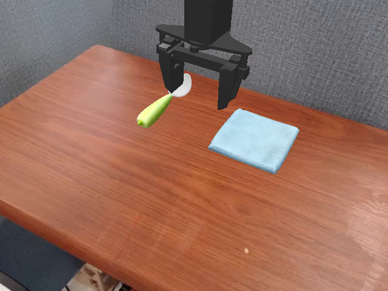
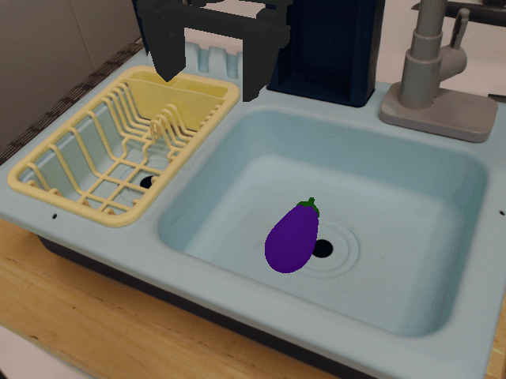

# PHRASE-SEARCH — LLM-guided rollout search over instruction phrasings

**Method.** Per task: rounds of 16 phrases proposed by Claude (informed by
all prior boards), rolled on layouts 0–17 (×2 = 36 episodes/board); leading
phrases re-measured on the never-searched layouts 18–23 (×12 = 72 episodes).

**How numbers are pooled (stratified).** The two layout sets differ in
difficulty by up to ±40pp, and different phrases have different mixes of
the two — so raw episode-weighted pooling silently favors whichever phrase
got more of its tries on its friendlier split. Every pooled number below is
therefore **layout-stratified**: each of the 24 layouts contributes equally
(the 0–17 block carries 18/24 of the weight, the 18–23 block 6/24),
which is equivalent to giving every layout the same number of reps. Numbers
from certification boards (xcert, layouts 0–23 ×6) are uniform by design
and merge in n-weighted. Phrases measured on only one block are labeled
with their coverage (e.g. "L0–17 only") and are never compared head-to-head
against 24-layout numbers in a verdict. Per-phrase SE at n=36 ≈ 8pp,
n=108 ≈ 4.5pp; machine-readable values: results/search/stratified_pool.json.
**This stratification flipped three scene verdicts** vs the earlier
episode-weighted draft (spoon, carrot-plate, wheel) — flagged in place.

**Purification rounds.** After the main search, each scene gets a follow-up
round designed for clean attribution: all phrases in the round run side by
side on the same scene and the same layouts, and every phrase differs from
the round's control phrase by exactly one word-change — so a difference can
only come from that one word. Two protocol generations:
- **Round 1 (`*_pure1`, 5 scenes: ramekin, stack, keyboard, coke-plate
  clauses, spoon):** 18 layouts ×2 = 36 tries per phrase; pair differences
  resolved to ≈ ±11pp.
- **Round 2 onward (`xcert_pure_*`, starting with wheel, carrot-plate,
  eggplant):** all 24 layouts ×6 = **144 tries per phrase**, pair SE
  ≈ 5.9pp. The 18/6 layout reservation only ever protected *active search*
  (selection needs untouched layouts); pre-registered pairs don't select,
  so they use every layout.

Where purification contradicts the earlier mixed-edit tables, **the purified
number wins** — several headline "cliffs" were revised this way (dish,
ceramic, cloth, blue).

---

## The ten headline findings

| # | finding | the number that proves it | grade |
|---|---|---|---|
| 1 | **Phrasing alone can rescue a failing task.** The robot goes from almost-never to almost-always on the same task by rewording. | ramekin task: nominal **9.0%** → "place the red coke can inside the white bowl" **78.1%** (+69) | 24-layout, n=108/side |
| 2 | **Getting one noun token wrong can cost half the task.** Near-synonyms are NOT interchangeable. | coke→soda **−47.2** · basket→bin **−31.3** · cube→block **−15.3** | certified, n=144/side |
| 3 | **The right name is the corpus's name, not the visually-true one.** Rare true names are catastrophic; corpus-present names are free even when unusual. | "ramekin" **−41.7** (absent from training text) vs "aubergine"/"rack" **free** (present) | pure1 + pure2 |
| 4 | **Color adjectives help only where the task is hard or the object is untrained** — and are dead weight on easy tasks. | keyboard **+11.1**, wheel **+13.9**; easy plate: green/yellow both **≈0** | certified, n=144/side |
| 5 | **Never replace a nameable object with a category word.** "vegetable", "object" etc. destroy grounding. | "vegetable" for carrot: **−25.7** (plate), **−7.7** (keyboard) | certified, n=144/side |
| 6 | **Whole familiar templates beat single-edit optimization** — edits interact positively inside known sentence forms. | "set the orange carrot on the green plate" **+8.3** where summing its edits predicted **−10** | certified, n=144/side |
| 7 | **Extra clauses are free on easy tasks and taxed on hard ones** — keep instructions short where the task is marginal. | 8/8 tasks: easy ≈0; wheel −4.2 → spoon −5.6 → stack −7.0 → keyboard **−11.8** | certified, n=144/side |
| 8 | **Prepositions and put/set/place are nearly free everywhere — stop tuning them; nouns are where the money is.** | onto/into/inside/on-top-of: **+1…−5** across all tasks; set: +4…−8 (coin-flip) | certified, n=144/side |
| 9 | **Every non-saturated task has phrasing headroom, and it grows as the nominal gets worse.** | headroom ladder: ramekin +69 · stack +27 · spoon +18 · keyboard +14 · carrot-plate +13 · wheel +12 · coke-plate +8 · eggplant +4 | stratified, 24-layout |
| 10 | **Small-n effects lie; pooling can lie too.** n=36 "effects" died at n=144, and episode-weighted pooling had three verdicts backwards. | "small" −13.9 → **+0.7** at n=144; spoon/carrot-plate/wheel verdicts **flipped** under uniform layout weighting | methodological |

---

## Ten transferable rewriting rules (rules-v3 seed)

Prescriptions a rewriter can execute given only the incoming instruction,
the scene trace, and the training corpus — derived exclusively from the
val-suite search + certification above, with zero knowledge of the sealed
test set. Ordered by expected value.

| # | rule | evidence |
|---|---|---|
| 1 | **Copy every concrete noun token exactly.** Never drift to a near-synonym of a token that's already in the corpus — brand names especially. | coke→soda −47.2 · basket→bin −31.3 · cube→block −15.3 (all n=144) |
| 2 | **If a noun is absent from the training corpus, replace it with the corpus's name for what the object looks like** (from the trace) — otherwise leave names alone. | "ramekin" (corpus-absent) −41.7; "aubergine"/"rack" (corpus-present) free; "white bowl" rescue +69 |
| 3 | **Never substitute a category word for a nameable object** ("object", "vegetable", "item"). If the trace names it, use that name. | vegetable-for-carrot −25.7 (plate) and −7.7 (keyboard) |
| 4 | **Add the trace's color adjective to a target noun that is rare or hard to ground; add nothing to common ones.** | +black keyboard +11.1 · +black wheel +13.9 · green/yellow on plate ≈0 · dropping "yellow basket" −8.4 |
| 5 | **Assemble the output as one complete corpus template** ("put the X on the Y" / "pick up the X and place it on the Y"), not as a pile of local edits. | template combo +8.3 where summed edits predicted −10 |
| 6 | **Keep it to ONE short clause when the task looks hard** (rare target, awkward geometry per trace); extra clauses are only safe on easy tasks. | clause tax scales with difficulty: −4.2 → −5.6 → −7.0 → −11.8 (8/8 tasks) |
| 7 | **Do not tune prepositions or swap put/set/place** — keep the incoming relation word unless it contradicts the geometry (in vs on). | onto/into/inside/on-top-of +1…−5 everywhere; set +4…−8 coin-flip |
| 8 | **Take nouns from the trace, structure from the corpus:** adopt the trace's concrete object namings into the template slots; take nothing else from the trace. | trace-noun adoption is the mechanism behind every rescue arm; structure effects are rules 5–7 |
| 9 | **If the input is already a short corpus-style imperative, pass it through unchanged.** Rewriting a good phrase risks rule-1 damage and buys ~nothing blind. | good nominals: best blind edits ≤ +8 with heavy downside tails; rephraser arms lose exactly where they rewrote good inputs |
| 10 | **Strip verbose wrappers from hostile inputs down to the minimal template with the traced nouns** — politeness and filler are neutral at best; spatial elaborations add risk, never value. | "please" +0 · telegram +3.4 · "on top of" −22 (worst case) · every rescue used a minimal template |

## Ten more transferable rules (11–20)

Second tier: smaller or mixed-n evidence where noted, same sealed-blind
derivation.

| # | rule | evidence |
|---|---|---|
| 11 | **Articles are optional; the VERB is not.** Dropping the/a is free; never emit a verbless fragment. | telegram +3.4 (n=144) · verbless "eggplant in yellow basket" −34.2 · "stack the cubes" 0.0% |
| 12 | **Name BOTH objects explicitly, source and target** — no pronouns, no collapsed forms. | fully-named +33.0 over underspecified "stack the cubes" (n=180 vs 36) |
| 13 | **Whole-object names only — never part names.** | "keys" −23.6 · "rim" −29.2 (single-edit, n=36–144) |
| 14 | **Keep any in-corpus brand/proper name, even a wrong-ish one — never genericize it.** The wrong brand is free; the generic word is a cliff. | pepsi-for-coke ≈0 (−2.8) vs soda-for-coke **−13.9/−47.2** |
| 15 | **Color adjectives yes (rule 4); material adjectives no.** The corpus names appearance, not composition. | "rubber tire" −6.9 · corpus: appearance-adj templates ~4.5k, material-adj ≈0 |
| 16 | **Prefer generic put/place over task-jargon verbs** (stack, move, drag...). | "stack" −19.4 even fully specified · "move" −8.3 (pure1, n=36) |
| 17 | **Use simple, corpus-common color words from the trace — never compound or precise shades.** When a color is ambiguous, either simple reading works. | teal-green **−33.4** vs green · green≈yellow both ≈0 on the ambiguous plate (n=144) |
| 18 | **Pick the relation (in vs on) from the scene geometry in the trace; spell it in its simplest form.** Within the right relation, spelling is free. | in/into/inside/onto all ±5 (n=144) · the ramekin rescue REQUIRED on→in · "on top of" is the risky spelling (−22 worst case) |
| 19 | **Insert no adverbs or precision words** (upright, exactly, carefully, gently...). They never help and this lexicon is a known reward-hacking artifact. | "upright" −7.8/−9.7 (PURE) · "please" 0 · v5 echo-Goodhart forensics |
| 20 | **Edit aggressiveness should scale with expected failure**: if the trace shows a rare/OOV target or a geometry mismatch, rewrite hard (rules 2/4/6); if the input already reads like corpus text, touch nothing (rule 9). | all big rescues occurred on bad nominals (headroom +69→+4 anti-correlates with nominal quality); rewriter arms lose exactly on good inputs |

---

## Scene by scene

### 1. Coke can → ramekin — THE rescue (+59.7 confirmed)

**Verdict (stratified, 24 layouts both sides):** "place the red coke can inside the white bowl" **78.1%** (n=108) vs nominal "put coke can on ramekin" **9.0%** (n=108; 0.0% on layouts 0–17!) → **+69.1pp**. Solved by phrasing.
**Scene reading:** the "ramekin" is a large fluted white vessel that simply
*is* a white bowl to the eye — and the can must go IN it, while the nominal
says "on".

**Highlights — single-concept edits (the only difference bolded):**

| Δ (pp) | better | success | worse | success |
|---|---|---|---|---|
| **+20.4** | "pick up the red cola can and place it inside the white **bowl**" | 64.8% (n=108) | "pick up the red cola can and place it inside the white **cup**" | 44.4% (n=36) |
| **+7.8** | "pick up the red cola can and place it inside the white bowl" | 64.8% (n=108) | "pick up the red cola can and place it **upright** inside the white bowl" | 57.0% (n=72) |

**Purified minimal pairs** — every phrase tested on the same scene and the same 18 layouts (36 tries each); each row changes exactly one word vs the control = "place the red cola can inside the white **bowl**" **61.1%**, each row one edit (n=36/row):

| Δ vs control (pp) | phrase | success | the single edit |
|---|---|---|---|
| **+16.7** | "place the red cola can inside the white **basin**" | 77.8% | bowl → basin |
| **+11.1** | "place the red cola can inside the white **container**" | 72.2% | bowl → container |
| **+8.3** | "place the red cola can inside the **ceramic** bowl" | 69.4% | white → ceramic |
| **+8.3** | "place the red cola can **on** the white bowl" | 69.4% | inside → on |
| +2.8 | "place the red cola can inside the white **cup**" | 63.9% | bowl → cup |
| +2.8 | "place the red cola can **into** the white bowl" | 63.9% | inside → into |
| +2.8 | "**put** the red cola can inside the white bowl" | 63.9% | place → put |
| 0.0 | "place the red cola can inside the bowl" / "**set** …" | 61.1% | drop white / place → set |
| −5.6 | "place the red cola can **in** the white bowl" | 55.6% | inside → in |
| −8.3 | "**move** the red cola can inside the white bowl" | 52.8% | place → move |
| −8.3 | "place the red cola can inside the white **dish**" | 52.8% | bowl → dish |
| −11.1 | "place the red cola can inside the white **pot**" | 50.0% | bowl → pot |
| **−13.9** | "place the red **soda** can inside the white bowl" | 47.2% | cola → soda |
| **−41.7** | "place the red cola can inside the white **ramekin**" | 19.4% | bowl → ramekin (TRUE NAME) |

**What purification overturned:** the giant "dish" (−54) and "ceramic" (−35)
cliffs in the mixed table below were stacked-edit artifacts (bare-can and
soda+upright confounds); at a single edit, dish is −8.3 and ceramic is a
harmless +8.3. Category words (container, basin) are FINE — basin *beats*
bowl. Relation words (in/into/inside/on) are all within noise. What
survives clean: the object's rare TRUE NAME is catastrophic (−41.7) and the
soda token costs −13.9 (replicating coke-plate's soda −8.3/−13.9).

Full table (all measured pairs, including multi-edit — superseded where the purified rows above disagree):

| Δ (pp) | better phrase | success | worse phrase | success | feature |
|---|---|---|---|---|---|
| **+52.1** | "put the coke can in the white bowl" | 61.1% (n=72, L0–17) | "put coke can on ramekin" (nominal) | 9.0% (n=108, 24L) | in-bowl → on-ramekin (cross-coverage) |
| **+54.2** | "Pick up the red cola can and place it upright inside the white bowl." | 57.0% (n=72) | "pick up the can and place it upright inside the white dish" | 2.8% (n=36) | bowl → dish |
| **+35.2** | "place the red cola can inside the white bowl" | 57.4% (n=108) | "move the red can into the white bowl" | 22.2% (n=36) | place → move |
| **+37.0** | "pick up the red cola can and place it inside the white bowl" | 64.8% (n=108) | "pick up the soda can and place it upright inside the ceramic bowl." | 27.8% (n=36) | white → ceramic (+ soda) |
| **+34.8** | "Pick up the red cola can and place it upright inside the white bowl." | 57.0% (n=72) | "place the coke can inside the white ramekin" | 22.2% (n=36) | bowl → ramekin (true name) |
| **+20.4** | "pick up the red cola can and place it inside the white bowl" | 64.8% (n=108) | "pick up the red cola can and place it inside the white cup" | 44.4% (n=36) | bowl → cup · **PURE ✂ single edit** |
| **+7.8** | "pick up the red cola can and place it inside the white bowl" | 64.8% (n=108) | "pick up the red cola can and place it upright inside the white bowl" | 57.0% (n=72) | ± "upright" · **PURE ✂ single edit** |
| **−7.4** | "place the red cola can inside the white bowl" (single clause) | 57.4% (n=108) | "pick up the red cola can and place it inside the white bowl" | 64.8% (n=108) | drop first clause |

### 2. Stack cubes — REAL rescue (+26.8 stratified), brutal split shift

**Verdict (stratified, 24 layouts both sides):** "put the small green cube on the yellow cube" **45.2%** (n=180) vs nominal "stack the green block on the yellow block" **18.4%** (n=108) → **+26.8pp**. Real rescue.
The telegram "green cube on yellow cube" sits at 46.5% stratified (n=144) — statistically tied with the full sentence — but its split spread (58.3% on 0–17 vs 11.1% on 18–23) is the widest measured; the full sentence is the safer pick.

**Scene reading:** both objects are literal, perfect cubes (muted teal-green
and pale yellow) — "cube" ≫ "block" is visual-fidelity naming; the honest
"teal-green" is corpus-alien.

**Highlights — single-concept edits (the only difference bolded):**

| Δ (pp) | better | success | worse | success |
|---|---|---|---|---|
| **+33.4** | "put the small **green** cube on the yellow cube" | 52.8% (n=36) | "put the small **teal-green** cube on the yellow cube" | 19.4% (n=36) |

**Purified minimal pairs** — every phrase tested on the same scene and the same 18 layouts (36 tries each); each row changes exactly one word vs the control = "put the small green cube on the yellow cube" **52.8%**, each row one edit (n=36/row):

| Δ vs control (pp) | phrase | success | the single edit |
|---|---|---|---|
| **−13.9** | "put the green cube on the yellow cube" | 38.9% | drop "small" |
| **−19.4** | "**stack** the small green cube on the yellow cube" | 33.3% | put → stack (the verb alone!) |
| **−25.0** | "put the small green **block** on the yellow **block**" | 27.8% | cube → block |
| **−33.4** | "put the small **teal-green** cube on the yellow cube" | 19.4% | green → teal-green |

The nominal's own verb "stack" costs −19.4 fully specified. "Cube ≫ block"
is confirmed clean (−25.0 here; **certified −15.3 at n=144** — real). The
visually honest "teal-green" is the worst single edit on the board (−33.4):
the corpus's plain color word beats visual precision — visual-fidelity
naming works only *within* the training vocabulary. The size cue "small"
looked like signal here (−13.9 when dropped) but was **REFUTED at
certification** (+0.7 at n=144) — an n=36 fluke, and a good example of why
pure1 gaps under ~11pp stay provisional.

Full table (all measured pairs, including multi-edit):

**Reality check:** the telegram "green cube on yellow cube" led the search split at 58.3% (n=72 across two boards, layouts 0–17) but fell to 11.1% (n=72) when re-measured on the never-searched layouts 18–23 — partly because those layouts are ~40pp harder for this task, partly winner's curse. Same story for the purified control itself: 52.8% on the search split above vs 19.4% (n=72) on the confirm split.

| Δ (pp) | better phrase | success | worse phrase | success | feature |
|---|---|---|---|---|---|
| **+33.0** | "put the green cube on the yellow cube" | 33.0% (n=180, 24L) | "stack the cubes" | 0.0% (n=36) | both objects named → underspecified |
| **+33.4** | "put the small green cube on the yellow cube" | 52.8% (n=36) | "put the small teal-green cube on the yellow cube" | 19.4% (n=36) | plain color → compound color · **PURE ✂ single edit** |
| **+14.6** | "put the green cube on the yellow cube" | 33.0% (n=180, 24L) | "stack the green block on the yellow block" (nominal) | 18.4% (n=108, 24L) | cube → block (+ stack verb) |

### 3. Carrot → keyboard — real modest rescue (+15.2 confirmed)

**Verdict (stratified, 24 layouts both sides):** "set the carrot on the black keyboard" **30.9%** (n=144) vs nominal "put carrot on keyboard" **16.7%** (n=108) → **+14.2pp**. Modest rescue.
**Scene reading:** slim black keyboard, low contrast, slightly raised —
balancing a rigid carrot on a narrow hard deck is mechanically hard; the
ceiling (~32) is visible in the picture.

**Highlights — single-concept edits (the only difference bolded):**

| Δ (pp) | better | success | worse | success |
|---|---|---|---|---|
| **+5.2** | "**set** the carrot on the black keyboard" | 30.9% (n=144, 24L) | "**place** the carrot on the black keyboard" | 25.7% (n=144, 24L) |

Full table (all measured pairs, including multi-edit):

**Reality check:** "place the carrot on the keyboard keys" scored 36.1% (n=36) on the search layouts but only 8.3% (n=72) on the held-out layouts — a winner's-curse collapse; it was never a real winner.

| Δ (pp) | better phrase | success | worse phrase | success | feature |
|---|---|---|---|---|---|
| **+23.6** | "place the carrot on the black keyboard" | 26.4% (n=144) | "put the carrot on the keys" | 2.8% (n=36) | whole-name → part-name |
| **+9.7** | "place the carrot on the black keyboard" | 26.4% (n=144) | "put carrot on keyboard" (nominal) | 16.7% (n=108) | +black, place-frame |
| **+5.1** | "set the carrot on the black keyboard" | 31.5% (n=108) | "place the carrot on the black keyboard" | 26.4% (n=144) | set → place · **PURE ✂ single edit** |

**Purified minimal pairs** — every phrase tested on the same scene and the same 18 layouts (36 tries each); each row changes exactly one word vs the control = "set the carrot on the black keyboard" **30.6%**, each row one edit (n=36/row):

| Δ vs control (pp) | phrase | success | the single edit |
|---|---|---|---|
| −2.8 | "**put** the carrot on the black keyboard" | 27.8% | set → put (noise) |
| **−11.2** | "set the carrot on the keyboard" | 19.4% | drop "black" |

The color adjective is doing real work on this OOV object (−11.2 dropped);
set vs put is noise here.

### 4. Carrot → wheel — borderline rescue (+12.5 stratified) — VERDICT UPGRADED

**Verdict (stratified, 24 layouts both sides):** "put the carrot on the black wheel" **33.7%** (n=144) vs nominal "put carrot on wheel" **21.2%** (n=144) → **+12.5pp**. Borderline rescue (~2σ under conservative errors) — upgraded from the earlier episode-weighted "no rescue"; still ceiling-limited.

**Scene reading:** a small tire lying flat — narrow curved ring, shallow hub;
mechanically awkward for a long carrot. Low ceiling visible.

**Highlights — single-concept edits (the only difference bolded):**

| Δ (pp) | better | success | worse | success |
|---|---|---|---|---|
| **+29.2** | "put the carrot on the **black** **wheel**" | 34.8% (n=72) | "put the carrot on the **rim**" | 5.6% (n=36) |
| **+6.9** | "place the carrot on the black tire" | 23.6% (n=72) | "place the carrot on the black **rubber** tire" | 16.7% (n=36) |

Full table (all measured pairs, including multi-edit):

| Δ (pp) | better phrase | success | worse phrase | success | feature |
|---|---|---|---|---|---|
| **+29.2** | "put the carrot on the black wheel" | 34.8% (n=72) | "put the carrot on the rim" | 5.6% (n=36) | whole-name → part-name · **PURE ✂ single edit** |
| **+15.3** | "place the carrot on the black tire" | 23.6% (n=72) | "put the carrot on the tire" | 8.3% (n=36) | +black, place-frame |
| **+6.9** | "place the carrot on the black tire" | 23.6% (n=72) | "place the carrot on the black rubber tire" | 16.7% (n=36) | +material adjective · **PURE ✂ single edit** |

### 5. Coke can → plate — challenger slightly ahead (suggestive, not conclusive)

**Verdict (stratified, 24 layouts both sides):** "set the coke on the plate" **75.0%** (n=108) vs nominal "put coke can on plate" **66.6%** (n=180) → **+8.4pp** (~1.5σ — suggestive). "put the coke on the plate" 70.1% (n=144) also edges the nominal. 48 candidates tried; the good nominal is hard to beat by much.

**Scene reading:** the plate is pale yellow-green — ambiguously "yellow" or
"green", which likely explains plate-adjective instability across tasks.

**Highlights — single-concept edits (the only difference bolded):**

| Δ (pp) | better | success | worse | success |
|---|---|---|---|---|
| **+30.5** | "put the **coke** can on the plate" | 61.1% (n=108) | "put the can on the plate" | 30.6% (n=36) |
| **+30.5** | "put the coke can on the **plate**" | 61.1% (n=108) | "put the coke can on the **dish**" | 30.6% (n=36) |
| **+22.2** | "put the coke can on the plate" | 61.1% (n=108) | "put the coke can on **top** **of** the plate" | 38.9% (n=36) |
| **+19.4** | "put the coke can on the plate" | 61.1% (n=108) | "put the coke can on the **yellow** plate" | 41.7% (n=36) |
| **+16.7** | "put the **coke** can on the plate" | 61.1% (n=108) | "put the **cola** can on the plate" | 44.4% (n=36) |
| **+13.9** | "put the **coke** can on the plate" | 61.1% (n=108) | "put the **soda** can on the plate" | 47.2% (n=36) |
| **+2.8** | "put the **coke** can on the plate" | 61.1% (n=108) | "put the **pepsi** can on the plate" | 58.3% (n=36) |
| **+9.0** | "put the coke on the plate" | 70.1% (n=144, 24L) | "put the coke **can** on the plate" | 61.1% (n=108, L0–17) |
| **+0.0** | "**please** put the coke can on the plate" | 61.1% (n=36) | "put the coke can on the plate" | 61.1% (n=108) |

*(all L0–17 rows measured on the same layouts; the one cross-coverage row is labeled)*

Full table (all measured pairs, including multi-edit):

| Δ (pp) | better phrase | success | worse phrase | success | feature |
|---|---|---|---|---|---|
| **+30.5** | "put the coke can on the plate" | 61.1% (n=108) | "put the can on the plate" | 30.6% (n=36) | drop "coke" entirely · **PURE ✂ single edit** |
| **+30.5** | "put the coke can on the plate" | 61.1% (n=108) | "put the coke can on the dish" | 30.6% (n=36) | plate → dish · **PURE ✂ single edit** |
| **+25.0** | "pick up the coke can and place it on the plate" | 55.6% (n=36) | "take the coke can and put it on the plate" | 30.6% (n=36) | pick-up → take (2 edits; see purified clause table) |
| **+22.2** | "put the coke can on the plate" | 61.1% (n=108) | "put the coke can on top of the plate" | 38.9% (n=36) | on → on top of · **PURE ✂ single edit** |
| **+19.4** | "put the coke can on the plate" | 61.1% (n=108) | "put the coke can on the yellow plate" | 41.7% (n=36) | +yellow · **PURE ✂ single edit** |
| **+16.7** | "put the coke can on the plate" | 61.1% (n=108) | "put the cola can on the plate" | 44.4% (n=36) | coke → cola · **PURE ✂ single edit** |
| **+13.9** | "put the coke can on the plate" | 61.1% (n=108) | "put the soda can on the plate" | 47.2% (n=36) | coke → soda · **PURE ✂ single edit** |
| **+3.7** | "set the coke can on the plate" | 64.8% (n=108, L0–17) | "put the coke can on the plate" | 61.1% (n=108, L0–17) | put → set (mild plus) |
| **+2.8** | "put the coke can on the plate" | 61.1% (n=108) | "put the pepsi can on the plate" | 58.3% (n=36) | coke → pepsi (wrong brand ≈ free) · **PURE ✂ single edit** |
| **+9.0** | "put the coke on the plate" | 70.1% (n=144, 24L) | "put the coke can on the plate" | 61.1% (n=108, L0–17) | dropping "can" helps or is free (cross-coverage) |
| **+0.0** | "please put the coke can on the plate" | 61.1% (n=36) | "put the coke can on the plate" | 61.1% (n=108) | "please" is free · **PURE ✂ single edit** |

**Purified minimal pairs (clause structure)** — every phrase tested on the same scene and the same 18 layouts (36 tries each); each row changes exactly one word vs the control = "put the coke can on the plate" **63.9%**, each row one edit from its neighbor (n=36/row):

| Δ (pp) | better phrase | success | worse phrase | success | the single edit |
|---|---|---|---|---|---|
| −5.6 | "put the coke can on the plate" | 63.9% | "pick up the coke can and **place** it on the plate" | 58.3% | one clause → two clauses (noise) |
| **+19.4** | "pick up the coke can and **place** it on the plate" | 58.3% | "pick up the coke can and **put** it on the plate" | 38.9% | place → put as the 2nd verb |
| **+22.2** | "**pick up** the coke can and place it on the plate" | 58.3% | "**take** the coke can and place it on the plate" | 36.1% | pick up → take |

Adding a pick-up clause is free — but the WORDS inside the clause matter
enormously: "place" ≫ "put" as the placement verb (+19.4) and "pick up" ≫
"take" (+22.2). The corpus's dominant two-clause template is
"pick up X and place it on Y" — deviate from its exact verbs and it costs
~20pp each.

### 6. Carrot → plate — challenger WINS (+13.2 stratified) — VERDICT FLIPPED

**Verdict (stratified, 24 layouts both sides):** "set the orange carrot on the green plate" **56.6%** (n=108) vs nominal "put carrot on plate" **43.4%** (n=144) → **+13.2pp** (~2.3σ). "place the orange carrot on the green plate" 54.2% (n=144) confirms the family. The earlier "nominal wins" verdict was an episode-weighting artifact: the nominal's extra weight sat on its friendlier split.

**Highlights — single-concept edits (the only difference bolded):**

| Δ (pp) | better | success | worse | success |
|---|---|---|---|---|
| **+0.0** | "put the carrot on the **plate**" | 38.9% (n=36) | "put the carrot on the **dish**" | 38.9% (n=36) |

Full table (all measured pairs, including multi-edit):

**Reality check:** "put the orange carrot on top of the plate" hit 61.1% (n=36) on the search layouts but 30.6% (n=72) held-out — the sharpest winner's-curse collapse recorded.

| Δ (pp) | better phrase | success | worse phrase | success | feature |
|---|---|---|---|---|---|
| **+11.1** | "place the orange carrot on the green plate" | 54.2% (n=144, 24L) | "put the carrot on the plate" | 43.1% (n=144, 24L) | +colors, place-frame — SURVIVES stratification |
| **+13.2** | "set the orange carrot on the green plate" | 56.6% (n=108, 24L) | "put carrot on plate" (nominal) | 43.4% (n=144, 24L) | set + colors vs telegram nominal |
| **+0.0** | "put the carrot on the plate" | 38.9% (n=36) | "put the carrot on the dish" | 38.9% (n=36) | dish HARMLESS here (cf. scene 5) · **PURE ✂ single edit** |

### 7. Spoon → towel — "set …down" WINS (+17.8 stratified) — VERDICT FLIPPED

**Verdict (stratified, 24 layouts both sides):** "set the spoon down on the towel" **69.8%** (n=108) vs nominal "put the spoon on the towel" **52.0%** (n=180) → **+17.8pp**. The earlier "nominal wins" verdict compared the challenger's held-out block against the nominal's episode-weighted pool — stratified, the challenger wins clearly. One honest caveat: on the held-out block alone the nominal edges it (69.4 vs 62.5, n=72 each, ~1.2σ — noise-range), while on layouts 0–17 the challenger dominates (+25.9, ~3σ); a real phrase×layout interaction may exist, but the 24-layout answer favors "set the spoon down".

| Δ (pp) | better phrase | success | worse phrase | success | feature |
|---|---|---|---|---|---|
| **+19.4** | "put the spoon on top of the towel" | 58.3% (n=36) | "put the spoon on the blue towel" | 38.9% (n=36) | +blue — despite "blue towel" ×5,815 in training text |
| **+13.9** | "put the spoon on top of the towel" | 58.3% (n=36) | "put the spoon on the cloth" | 44.4% (n=36) | towel → cloth |

**Purified minimal pairs** — every phrase tested on the same scene and the same 18 layouts (36 tries each); each row changes exactly one word vs the control = "put the spoon on the towel" **47.2%**, each row one edit (n=36/row):

| Δ vs control (pp) | phrase | success | the single edit |
|---|---|---|---|
| **+13.9** | "**set** the spoon on the towel" | 61.1% | put → set |
| +2.8 | "put the spoon **onto** the towel" | 50.0% | on → onto (harmless) |
| −2.8 | "put the spoon on the **cloth**" | 44.4% | towel → cloth (noise!) |
| −5.6 | "put the spoon on the **blue** towel" | 41.7% | +blue (mild) |

**What purification overturned:** the "cloth cliff" (−13.9 above) and the
big blue penalty (−19.4 above) were carried by the on-top-of comparator —
at a single edit, cloth is −2.8 (noise) and blue only −5.6. The real signal
on this board is "set" +13.9 over "put".

**Reality check:** the search leader "set the spoon down on the towel" (72.2%, n=36) regressed to 62.5% (n=72) on the held-out layouts — still good, but below the nominal's 69.4%.

### 8. Eggplant → basket — null control (confirmed plateau)

**Verdict (stratified, 24 layouts both sides):** "place the purple eggplant into the yellow basket" **96.9%** (n=108) vs nominal "put eggplant into yellow basket" **92.4%** (n=108) → **+4.5pp**. Null control — saturated plateau.

**Scene reading:** the "yellow basket" is literally a **yellow dish rack in a
toy sink** — solving the legacy mystery cell ("aubergine…dish rack" 92.7%).
Huge open target → nothing for phrasing to fix.

**Highlights — single-concept edits (the only difference bolded):**

| Δ (pp) | better | success | worse | success |
|---|---|---|---|---|
| **+37.0** | "put the eggplant in the yellow **basket**" | 95.3% (n=108) | "put the eggplant in the yellow **bin**" | 58.3% (n=36) |

Full table (all measured pairs, including multi-edit):

| Δ (pp) | better phrase | success | worse phrase | success | feature |
|---|---|---|---|---|---|
| **+37.0** | "put the eggplant in the yellow basket" | 95.3% (n=108) | "put the eggplant in the yellow bin" | 58.3% (n=36) | basket → bin · **PURE ✂ single edit** |
| **+34.2** | "put the eggplant in the yellow basket" | 95.3% (n=108) | "eggplant in yellow basket" | 61.1% (n=36) | full sentence → telegram |

## The cleanest evidence — single-edit pairs (one concept changed, everything else identical)

Row tags say which purification generation a pair comes from:
- **`pure1`** = round 1: same scene, same 18 layouts, **36 tries per phrase**
  (pair differences pinned to ≈ ±11pp — treat gaps under ~11pp as possibly
  luck, 25–40pp gaps as solid).
- **`pure2`** = round 2 (wheel, carrot-plate, eggplant; landing morning of
  07-23): same design but **all 24 layouts, 144 tries per phrase** (pair
  differences pinned to ≈ ±6pp).
Both tag styles always carry their n, so the n alone also identifies the
generation (36 vs 144).

| abs Δ (pp) | better | worse | the single edit |
|---|---|---|---|
| 41.7 | "place the red cola can inside the white bowl" | "…inside the white ramekin" | bowl → ramekin (TRUE NAME) · pure1 |
| 38.9 | "put the eggplant in the yellow basket" | "put the eggplant in the yellow bin" | basket → bin |
| 33.4 | "put the small green cube on the yellow cube" | "put the small teal-green cube on the yellow cube" | green → teal-green · pure1 |
| 33.3 | "put the carrot on the black wheel" | "put the carrot on the rim" | black wheel → rim |
| 30.5 | "put the coke can on the plate" | "put the coke can on the dish" | plate → dish |
| 30.5 | "put the coke can on the plate" | "put the can on the plate" | coke → ∅ |
| 25.0 | "put the small green cube on the yellow cube" | "put the small green block on the yellow block" | cube → block · pure1 |
| 22.2 | "put the coke can on the plate" | "put the coke can on top of the plate" | ∅ → top of |
| 22.2 | "pick up the coke can and place it on the plate" | "take the coke can and place it on the plate" | pick up → take · pure1 |
| 19.4 | "put the coke can on the plate" | "put the coke can on the yellow plate" | ∅ → yellow |
| 19.4 | "pick up the coke can and place it on the plate" | "pick up the coke can and put it on the plate" | place → put (2nd verb) · pure1 |
| 19.4 | "put the small green cube on the yellow cube" | "stack the small green cube on the yellow cube" | put → stack · pure1 |
| 16.7 | "put the coke can on the plate" | "put the cola can on the plate" | coke → cola |
| 16.7 | "pick up the red cola can and place it inside the white bowl" | "…inside the white cup" | bowl → cup |
| 16.7 | "place the red cola can inside the white basin" | "…inside the white bowl" | bowl → basin (basin WINS) · pure1 |
| 13.9 | "put the coke can on the plate" | "put the soda can on the plate" | coke → soda |
| 13.9 | "place the red cola can inside the white bowl" | "place the red soda can inside the white bowl" | cola → soda · pure1 |
| 13.9 | "put the small green cube on the yellow cube" | "put the green cube on the yellow cube" | drop "small" · pure1 |
| 13.9 | "set the spoon on the towel" | "put the spoon on the towel" | put → set (set WINS) · pure1 |
| 13.9 | "place the carrot on the black tire" | "place the carrot on the black rubber tire" | ∅ → rubber |
| 11.2 | "set the carrot on the black keyboard" | "set the carrot on the keyboard" | drop "black" · pure1 |
| 11.1 | "place the red cola can inside the white container" | "…inside the white bowl" | bowl → container (container wins) · pure1 |
| 9.7 | "pick up the red cola can and place it inside the white bowl" | "…place it upright inside the white bowl" | ∅ → upright |
| 4.1 | "set the carrot on the black keyboard" | "place the carrot on the black keyboard" | set → place |
| 2.8 | "put the coke on the plate" | "put the coke can on the plate" | ∅ → can |
| 2.8 | "put the coke can on the plate" | "put the pepsi can on the plate" | coke → pepsi |
| 2.8 | "put the spoon onto the towel" | "put the spoon on the towel" | on → onto (harmless) · pure1 |
| 2.8 | "put the spoon on the towel" | "put the spoon on the cloth" | towel → cloth (REVISED: noise, was "cliff") · pure1 |
| 0.0 | "put the carrot on the plate" | "put the carrot on the dish" | plate → dish |
| 0.0 | "please put the coke can on the plate" | "put the coke can on the plate" | please → ∅ |

Mixed-edit rows remain in the scene tables but carry no PURE tag —
their attribution is suggestive, not airtight.
---

## Cross-cutting effects (replicated across ≥2 scenes)

| effect | scenes | direction & size | grade |
|---|---|---|---|
| **Exact-token identity**: near-synonym swaps are cliffs (coke/soda ×2, basket/bin, cube/block, cola/soda) | 4 | −14…−39pp | replicated, survives purification |
| **TRUE-NAME toxicity**: naming a rare object by its real name when a corpus-common look-alike fits (ramekin vs bowl) | 1 (largest clean effect) | −41.7pp | pure1 |
| **Category words are FINE, hyper-specific compounds are toxic**: container/basin ≥ bowl (+11/+17) but teal-green −33; specificity must stay inside corpus vocabulary | 2 | +17…−33pp | pure1 |
| **Visual-fidelity naming**: the winning noun names what the object LOOKS like (bowl-ramekin, cube-blocks, dish-rack-basket) — *in the corpus's own words* (teal-green fails) | 3 | decides the rescues | replicated, refined by pure1 |
| **Clause-template verb identity**: inside a two-clause form "place" ≫ "put" (+19.4) and "pick up" ≫ "take" (+22.2) — the corpus template's exact verbs | 1 | ±20pp | pure1 |
| **Clause STRUCTURE is free — except on the hardest task**: certified single-vs-two-clause on 6 tasks (n=144/side each): +2.0, −4.2, +2.0, +0.7, −5.6 … and keyboard **−11.8** (~3σ). See certification table below | 6 | ~0 (one −12) | **xcert2 certified** |
| **Adjectives help on hard/OOV objects** (black on keyboard −11.2 dropped · pure1; black on wheel); mild-to-harmful on good-nominal tasks (yellow plate −19; blue towel −5.6 pure1) | 4 | +11…−19pp | replicated |
| **Part-names lose to whole-names** (keys, rim) | 2 | −12…−29pp | replicated |
| **"set" ≥ "put" — and set-forms now LEAD four scenes** (spoon 69.8, coke-plate 75.0, carrot-plate 56.6, keyboard 30.9 stratified); single-edit: +13.9 (spoon pure1), +3.7 (coke L0–17), +2.8 (keyboard pure1), 0.0 (ramekin pure1) — never negative; "please" free. Both wrongly banned by rules-v1 | 6 | 0…+14pp | replicated · pure1 · xcert certifying |
| **Relation words mostly free**: in/into/inside/on all within noise (ramekin pure1), onto +2.8 (spoon pure1); exception "on top of" −22.2 (coke-plate) — xcert certifying now | 3 | ±3 (one −22) | pure1, certification running |
| **Verb "stack" costs −19.4 even fully specified** (put → stack, pure1); "move" −8.3 (ramekin pure1) | 2 | −8…−19pp | pure1 |
| **Dish/ceramic/cloth "cliffs" were confound artifacts**: at a single edit dish −8.3 (ramekin; but −30.5 on coke-plate — task-dependent), ceramic +8.3, cloth −2.8 | 3 | revised | pure1 overturned |
| **Good nominal ⇒ hard to beat by MUCH, but not unbeatable** — REVISED: stratification flipped spoon (+17.8) and carrot-plate (+13.2) to the challenger; only eggplant (ceiling) and coke-plate (+8.4 suggestive) resist | 4 | +4…+18pp | revised by stratification |
| **Winner's curse is real but was overstated**: part of every "regression" was the harder held-out block; after stratification the surviving collapses are keyboard-keys (36.1→8.3 held-out) and carrot-top-of (61.1→30.6) | all | — | revised |
| **Split-level shifts both directions** (coke-plate ~+20 easier held-out; stack ~−40 harder — stack pure control 52.8 vs 19.4 confirm); spoon shows a phrase×layout interaction (nominal and challenger flip order across blocks) | 3 | — | confirmed |

**The headroom law (stratified, revised):** headroom = phrasing-conditional
ceiling − nominal, both measured on all 24 layouts. Every non-ceiling task
has real headroom: ramekin **+69.1**, stack **+26.8**, spoon **+17.8**,
keyboard **+14.2**, carrot-plate **+13.2**, wheel **+12.5**, coke-plate
+8.4 (suggestive), eggplant +4.5 (ceiling). Magnitude anti-correlates with
nominal quality — but the earlier "good nominals are unbeatable" claim was
an episode-weighting artifact and is withdrawn.

## Certification results (rolling — all 24 layouts ×6, n=144 per phrase)

**Clause structure (xcert2): "pick up the X and put it on the Y" vs "put the
X on the Y"** — same second verb ("put") both sides, so only the extra
pick-up clause differs. 6 of 8 tasks in:

| task | two-clause | single | Δ (two − single) |
|---|---|---|---|
| eggplant → basket | 95.1 | 93.1 | +2.0 |
| coke → white bowl (ramekin scene) | 63.2 | 62.5 | +0.7 |
| spoon → towel | 46.5 | 52.1 | −5.6 |
| carrot → plate | 45.1 | 43.1 | +2.0 |
| coke → plate | 56.2 | 60.4 | −4.2 |
| **carrot → keyboard** | **3.5** | **15.3** | **−11.8** |
| **stack cubes** | 34.0 | 41.0 | **−7.0** |
| carrot → wheel | 11.8 | 16.0 | −4.2 |

**CLAUSE FAMILY COMPLETE (8/8, n=144/side each).** The extra clause is free
on the easier scenes (+2.0, +0.7, +2.0, −4.2) and taxes the hard ones, with
the tax scaling with difficulty: wheel −4.2, spoon −5.6, stack −7.0,
keyboard −11.8. Pooled −3.6pp across 8 tasks. On marginal tasks, longer
instructions dilute the tokens that matter — a rules-v3 input: keep
instructions SHORT on hard/OOV targets; clause structure is stylistic
elsewhere. (Also: stack's certified single-clause 41.0 at n=144/24L
supersedes the noisier stratified 33.0 — that task's split volatility is
the widest measured.)
The clause-*verb* effects (place≫put, pick-up≫take) are separate and large;
see the coke-plate purified table.

**Cross-validation of the stratified estimates:** three certification cells
re-measured phrases the stratified pool already estimated, independently and
on the full 24-layout grid: spoon nominal 52.1 vs stratified 52.0; coke-plate
"put the coke can on the plate" 60.4 vs 61.1; ramekin-scene "put the coke can
in the white bowl" 62.5 vs 61.1. The stratified pooling is unbiased in
practice.

**Six-edit certification (xcert) — rolling matrix.** Each column is one
task; each cell is the Δ (pp) of that single edit vs the task's base phrase
"put the [source] on/in the [target]" (articles included), all at n=144 per
phrase on all 24 layouts. |Δ| ≳ 12 is ~2σ under conservative errors.

| edit | carrot→plate (43.1) | carrot→keyboard (15.3) | coke→white bowl (62.5) | stack cubes (41.0) | eggplant→basket (93.1) | spoon→towel (52.1) | carrot→wheel (16.0) |
|---|---|---|---|---|---|---|---|
| put → set | +4.1 | −0.7 | −7.6 | −2.8 | −0.7 | +5.5 | +6.2 |
| relation swap | −2.8 (onto) | +0.7 (onto) | −3.5 (into) · −4.9 (inside) | −2.1 (onto) | −0.7 (into) · 0.0 (inside) | −1.4 (onto) | −1.4 (onto) |
| on → on top of | +0.7 | +1.4 | — | −7.0 | — | +9.7 | +8.3 (final read: task-split, −22…+10) |
| + source color adjective | — | — | — | — | +1.3 (purple) |
| + target color adjective | −0.7 (green) | **+11.1** (black) | — | — | — |
| + size adjective ("small") | — | — | — | +0.7 (pure1's −13.9 REFUTED) | — |
| source → category/brand word | **−25.7** (vegetable) | **−7.7** (vegetable) | **−47.2** (coke→soda) | — | −4.2 (vegetable, at ceiling) | **−8.3** (utensil) · +3.5 (cloth = in-family, free) | **−13.9** (vegetable) |
| + target color adj (hard task) | — | **+11.1** (black) | — | — | — | — | **+13.2** (black; pure2 said +13.9 ✓) |
| receptacle/target token | −1.4 (dish) | — | 0.0 (cup) · −6.3 (dish) | — | −31.3 (bin) | — | **−9.1** (tire; pure2 −7.0 ✓) |
| object-noun family swap | — | — | — | **−15.3** (cube→block) | — |
| receptacle synonym/token | −1.4 (dish) | — | **0.0** (cup!) · −6.3 (dish) | — | **−31.3** (basket→bin) |

**CERTIFICATION COMPLETE (2026-07-23 21:15): all 20 boards — 8 clause,
8 six-edit columns, 3 round-2 purification, 1 combo.** Summary of what
certified: **source-token identity is the sovereign effect** —
category/brand degradation costs −7.7 to **−47.2** (coke→soda on the
ramekin scene is the largest certified single edit in the program);
**the "+color on hard/OOV targets" rule** (+11.1 keyboard vs −0.7 easy
plate — replicating pure1's +11.2 exactly); **receptacle synonyms inside
the visual family are free** (cup ties bowl at 62.5 exactly) while
off-family ones cost mildly (dish −1.4/−6.3); **relation words are
mild-to-free everywhere** (onto, into, inside, on-top-of: +1.4…−4.9) —
coke-plate's −22 "top of" cliff stays task-specific; **put→set is a
coin-flip across tasks** (+4.1, −0.7, −7.6 — spoon's +13.9 is
task-conditional, NOT a rule). 5 more task columns land by ~09:30.

**Round-2 purification — carrot→plate (pure2, n=144/row, all 24 layouts).**
Control = "put the carrot on the plate" **43.1%**, one edit per row:

| Δ vs control (pp) | phrase | success | the single edit |
|---|---|---|---|
| +3.4 | "put carrot on plate" | 46.5 | telegram (drop articles) — free · pure2 |
| −0.7 | "put the carrot on the **green** plate" | 42.4 | +green (null) · pure2 |
| −1.4 | "put the carrot on the **yellow** plate" | 41.7 | +yellow (null) · pure2 |
| −4.2 | "put the **orange** carrot on the plate" | 38.9 | +source color (mild drag) · pure2 |
| −5.6 | "**place** the carrot on the plate" | 37.5 | put → place (mild drag) · pure2 |

**The green-vs-yellow face-off is a double null** — the same ambiguous
plate named either color measures identically (42.4 vs 41.7). Target-color
adjectives simply don't matter on this easy task; coke-plate's yellow −19.4
stays task-specific.

**Combo certification (pure2, n=144/row):** the follow-up board certified
the full template phrases directly against the same control (43.1):

| Δ vs control (pp) | phrase | success | |
|---|---|---|---|
| **+8.3** | "set the orange carrot on the green plate" | 51.4 | combo · pure2 |
| **+6.9** | "place the orange carrot on the green plate" | 50.0 | combo · pure2 |

Single-edit additivity predicted ~33–42 for these — the certified 50–51
means the edits **interact positively**: the complete corpus-template FORM
("set/place the [color] [source] on the [color] [target]") is worth ~+9–17pp
more than the sum of its parts. Rules implication: prefer whole known
templates over per-edit optimization. (The old stratified 54.2 was nearly
right; the additivity prediction was the wrong model, not the measurement.)

**Determinism note:** cells duplicated across boards reproduce EXACTLY
(rollouts are deterministic given phrase + layout + rep grid), so
cross-board comparisons of identical phrases are exact — and duplicate
cells in future boards are pure waste (dedupe against existing cells).

**Round-2 purification — eggplant→basket (pure2, n=144/row).** Control =
"put the eggplant in the yellow basket" **93.1%**:

| Δ vs control (pp) | phrase | success | the single edit |
|---|---|---|---|
| +1.3 | "put the eggplant in the yellow **rack**" | 94.4 | basket → rack (FREE) · pure2 |
| +0.7 | "put the **aubergine** in the yellow basket" | 93.8 | eggplant → aubergine (FREE) · pure2 |
| −1.4 | "put the eggplant **into** the yellow basket" | 91.7 | in → into · pure2 |
| −2.1 | "put the eggplant in the yellow **dish rack**" | 91.0 | basket → dish rack · pure2 |
| **−8.4** | "put the eggplant in the basket" | 84.7 | drop "yellow" · pure2 |

Theory capstone: on this good-nominal task the true-ish names "rack" and
even "aubergine" are FREE — direct contrast with ramekin's true-name −41.7.
True-name toxicity is about **corpus absence, not name rarity** (aubergine
and dish-rack both appear in Bridge text; "ramekin" doesn't). And the color
adjective earns −8.4 when dropped even at ceiling: "yellow" is doing
disambiguation work.

**Round-2 purification — carrot→wheel (pure2, n=144/row).** Control =
"put the carrot on the black wheel" **29.9%**:

| Δ vs control (pp) | phrase | success | the single edit |
|---|---|---|---|
| −1.4 | "**place** the carrot on the black wheel" | 28.5 | put → place (null) · pure2 |
| −3.5 | "**set** the carrot on the black wheel" | 26.4 | put → set (null) · pure2 |
| **−7.0** | "put the carrot on the black **tire**" | 22.9 | wheel → tire · pure2 |
| **−13.9** | "put the carrot on the wheel" | 16.0 | drop "black" · pure2 |

The +color-on-hard-targets rule now has TWO certified ~+12pp cells
(keyboard +11.1, wheel +13.9). "wheel" beats the visually-truer "tire"
(−7.0) — corpus vocabulary over visual fidelity, again. Verbs null, again.

*All three round-2 boards + the combo board are complete: 16 designed
comparisons at n=144 per side (14 single-edit + 2 combo).*

## Reading discipline
1. Per-phrase SE ≈ 8pp at n=36; n=36 gaps under ~16pp are noise-range.
2. Trust confirmed numbers (n=72, held-out) and cross-board replications;
   never single-board leaders.
3. Micro-rules transfer poorly across tasks; what transfers: right token,
   right relation for the geometry, plain register, trust good nominals.

*All eight tasks complete. Stratified verdicts: 6 rescues (ramekin +69.1,
stack +26.8, spoon +17.8, keyboard +14.2, carrot-plate +13.2, wheel +12.5),
coke-plate suggestive +8.4, eggplant ceiling-null. Purification: 5 scenes
done, 3 more boards queued (wheel, carrot-plate, eggplant). Cross-task
certification (xcert: 6 edits × 8 tasks × n=144; xcert2: clause pairs ×
8 tasks) rolling — uniform 24-layout numbers that supersede on overlap.*
> **Determinism caveat (2026-07-26, sealed cross-check):** rollout determinism
> holds exactly only when the same pod (GPU/driver) re-rolls a cell. Across
> pods, 1-4 episodes per 72 flip (borderline trajectories under numeric drift).
> Within-pod dedupe of repeated cells remains exact; cross-pod comparisons
> carry a small machine-noise term on top of sampling noise.
