# Teaching a small model to rephrase for a frozen robot policy

*Working paper draft. [EXPERIMENT.md](EXPERIMENT.md) holds the full protocol and
lab notebook; numbers are canonical in `results/**/metrics.json`. This is the
narrative.*

## The idea

A vision-language-action (VLA) policy maps a camera image + instruction to robot
actions, and the *phrasing* matters: "put carrot on plate" and "place the carrot
onto the plate" are the same request but the frozen policy responds differently.
CoVer exploits this at test time by generating rephrasings and picking good ones
with a trained verifier. We ask a sharper question: **can we train a small model to
*produce* the rephrasings a specific frozen policy prefers, using only that policy's
own action loss as reward?** If so, a tuned 9B model should out-phrase a frontier
model for this policy — because "what phrasing helps this policy" isn't in the
frontier prior; it has to come from the reward.

## The reward

The frozen policy is π0, a flow-matching VLA fine-tuned on BridgeV2. Flow-matching
policies give no likelihood, but they have a denoising loss. For ground-truth action
`a*` (28-dim: 4 steps × 7 DoF), sample noise `ε ~ N(0,I)` and flow time `τ ∈ (0,1)`,
form `xτ = τ·ε + (1−τ)·a*`, and the policy predicts velocity `u = ε − a*`. The
instruction `ℓ` enters only as conditioning:

```
L(ℓ) = E_{ε,τ} ‖ v_θ(xτ, o, ℓ, τ) − u ‖²          reward R(ℓ) = −L(ℓ)
```

Lower loss = the policy denoises `a*` better under that phrasing = better reward. We
estimate `L` with `K` noise draws and score **every rephrasing of a context against
the same K draws** (common random numbers), so differences reflect wording, not
sampling luck — the variance-reduction trick behind "Diffusion Classifier." Within a
group we use group-normalized advantages `A_i = (R_i − mean)/(std + ε)`.

**Length can't game it.** `ℓ` affects `L` only through attention; there's no term
that scales with token count (`L` is an MSE over the fixed 28-dim action, not a sum
over the phrase). Empirically, phrase-length/loss correlation is ~0.

## Does the reward actually discriminate? (the OpenVLA worry)

We tried this instinct once before, on OpenVLA, and it collapsed — a run drifted to a
single generic sub-goal ("grab X") and the val action metric barely moved. Our
**leading hypothesis**: OpenVLA's language grounding is weak enough that its action
loss carries almost no signal about *phrasing* — so the only gradient the optimizer
could find pointed back toward OpenVLA's own training-distribution templates (hence
the collapse to "grab X" specifically, not random degeneration). If phrasing barely
moves the reward except by resembling training data, RL can only rediscover that
data. (A related contributor: OpenVLA's *discretized* action head may be too coarse
to respond to wording at all.) π0's continuous velocity loss and stronger VLM
backbone should carry real phrasing signal — but that's a hypothesis, so we gate on
it (Phase 0b) rather than assume it.

*Terse test to confirm the diagnosis:* run Phase 0b unchanged on OpenVLA — same
contexts, score N rephrasings by OpenVLA's action loss, measure split-half rank
reliability. If it's flat on OpenVLA but reliable on π0 (below), the failure was the
reward carrying no phrasing signal, not the general idea. A sharper variant: check
whether OpenVLA's reward correlates with *resemblance to its training templates*
rather than with semantic fit — if so, that's the collapse attractor made explicit.

## Phase 0b — is the reward reliable?

**Setup.** 250 held-out BridgeV2 contexts (context = camera frame + instruction +
executed action). 32 rephrasings each from Gemini 3.1 Pro, Gemini 3.5 Flash, and
base Qwen3.5-9B; scored by frozen π0 under 16 shared draws, on two π0 checkpoints.

**Result: reliable, decisively.** Split the 16 draws in half, re-rank independently:
the two rankings agree at median Spearman **ρ ≈ 0.95** (signal share ≈ 0.98). At the
draw budget we can afford per training step, ~98% of phrase-to-phrase variation is
reproducible signal. Length/loss correlation ~0.

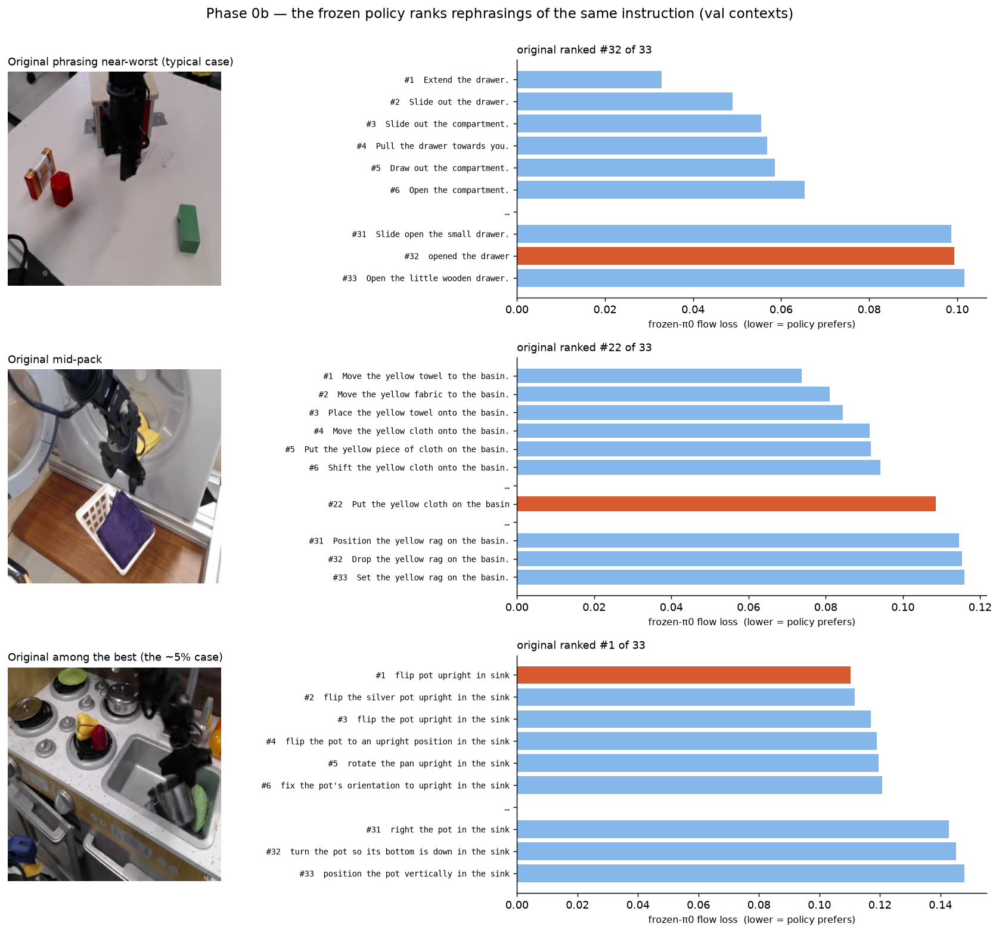

**What the policy prefers.** Each row: one frame, its 32 rephrasings ranked by π0
flow loss (shorter bar = preferred), **original Bridge instruction in orange.** The
headline result: **the original instruction is worse than the median rephrasing in
71% of contexts, and the single best in only 5%.** Top row is typical — "opened the
drawer" (terse Bridge label) ranks 32/33. Bottom row is one of the ~5% where the
original wins. π0, trained on paraphrase-augmented data, systematically prefers
cleaner phrasings. **Best-of-32 beats the original in 96–98% of contexts, cutting
loss a median 31–33%** — that's the headroom the project targets.

**Findings that shape next steps.**
- *Which checkpoint:* the paraphrase-trained π0 has ~25% smaller phrase spread than
  the plain one, but group-normalized advantages cancel absolute spread — only
  ranking reliability reaches the gradient, and it's equal (ρ≈0.95). So we **use the
  paraphrase (rephrase-FT) checkpoint**: it's the policy we roll out, avoiding a
  train/eval mismatch.
- *Noise band:* discriminability collapses near the clean-action end; we concentrate
  training draws where the signal lives (~25% fewer forwards, same fidelity).
- *Generator size:* base Qwen's reward spread is 75–100% of Gemini's — diverse
  enough, no larger generator needed. What it lacks is *direction*, which is the
  reward's job.

## Phase 0c — phrasing moves behavior, and the reward has a blind spot

We rolled out the frozen policy in the SIMPLER simulator under every rephrasing
(1,290 episodes: 4 tasks × ~33 phrasings × 10 shared initial states), and scored
the same phrasings offline on matched real Bridge contexts.

**Phrasing strongly moves task success** — the clean, all-in-sim result. On the
carrot task, success ranges **0.1 to 0.7** across phrasings of the same request on
identical initial states. The failures are interpretable: phrases whose *goal*
drifted ("put the carrot **by** the plate", "maneuver the spoon **past** the
towel") fail in exactly the way their words say.

**And that exposed a real blind spot in the reward.** The offline flow loss
*prefers* goal-drifted phrases: they score **better** (mean loss 0.081) than
clean rephrasings (0.095) while succeeding **less** (0.32 vs 0.58). Notably the
blind spot is specific to *goal* drift: object *renames* ("the orange vegetable")
succeed at the highest rate of any class (0.65) and get no reward discount. The
mechanism: teacher-forced loss measures how well the policy predicts the
demonstrated trajectory, which mid-episode is dominated by reach-and-transport
motion — "toward the plate" and "by the plate" demand nearly identical actions
until the final centimeters. Style fits; goals barely register. This drove the raw
reward↔success correlation negative (pooled ρ=−0.10); excluding judged goal-drift
(the exact Phase 2 gate) removes the anti-correlation. CORRECTION (2026-07-09): an
earlier draft reported the gated correlation as ρ≈+0.28; that number came from
pooling unnormalized within-task ranks across different-size tasks — a rank-scale
artifact. Properly computed, gated flow-loss validity is ρ ≈ 0.0–0.06: the gate
removes the poison, and what remains carries essentially no fine-grained signal
about rollout success (see the reward bake-off below).

**Design consequence.** This is a *confirmed reward-hacking axis*: naive RL on flow
loss would learn to emit trajectory-plausible, wrong-goal phrases. Phase 2 therefore
uses a **faithfulness-gated reward** — candidates judged unfaithful to the original
instruction are excluded/penalized before advantages are computed; flow loss ranks
only within the faithful set. (One more honest note: in sim, the *canonical*
original instructions are strong — the policy saw them verbatim in training — so
the offline finding that "originals rank poorly" reflects Bridge's messy labels,
not a universal advantage of rephrasing.)

## Step-0 — the reward survives the real training distribution, and reasoning source doesn't matter much

Before training we re-validated everything on the *actual* generation setup (CoVer's
verbatim template) with three arms: Gemini (the frontier baseline), base Qwen writing
its own inline reasoning, and base Qwen given a cached Gemini reasoning trace
(two-prompt flow).

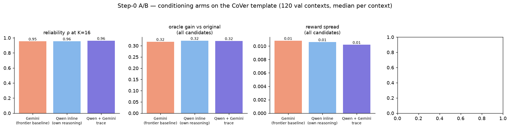

Three results, one per panel: **reliability holds** on the true training distribution
(split-half ρ = 0.95–0.96 for all three arms — the 0b gate re-passes); **oracle
headroom is unchanged** (best-of-32 beats the original instruction by ~32% in all
arms); and **reward spread is healthy and nearly identical** across arms. On every
measurable-without-a-judge axis, giving the 9B model a frontier reasoning trace
changes nothing — its own inline reasoning produces candidates the reward finds
equally rich. The remaining discriminator (goal-drift rate per arm) awaits API
credits; unless it shows a large gap, **we selected **trace conditioning as primary** (matching CoVer's deployment shape: one frontier reasoning call at boot, then phrase generation — here by the tuned 9B instead of the frontier model). Inline self-reasoning continues as an ablation; on judge-free axes the two are equivalent.**

**Training-loop status.** The full RL stack (generate → faithfulness gate → CRN
score → advantage-weighted update) has been validated end to end: the trainer loads
2,000 contexts, attaches a 29M-parameter LoRA, generates and parses candidates, and
— by design — refuses to train ungated: when the judge API became unavailable it
checkpointed at step 0 and paused rather than optimize an unprotected reward. First
training curves follow once the gate is back.

## Reward bake-off — which offline signal actually predicts task success?

Before betting more training compute on any single reward, we compared candidate
offline rewards against ground-truth rollout success: 94 drift-gated phrases across
three tasks, each labeled by 10–25 SIMPLER rollouts on shared initial states,
evaluated leave-one-task-out.

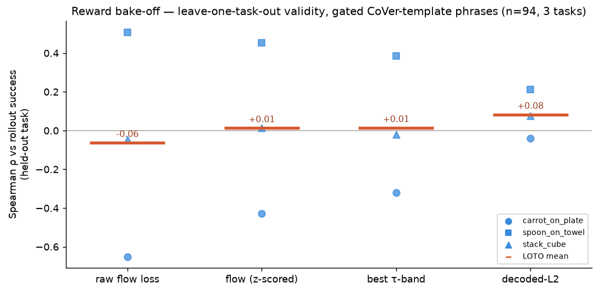

Three results. **First, no offline proxy is strongly predictive** at this
granularity — a sobering, useful calibration. **Second, flow-loss variants are
wildly task-inconsistent** (+0.5 on one task, −0.65 on another), and the
anti-correlated case has a clean mechanism: that task's phrase set is rename-heavy
("dish", "orange veggie"), and the paraphrase-trained policy predicts demonstrated
actions just fine under renames — but renamed referents ground *worse in the
simulator*, so flow reward and sim success actively disagree about them. **Third,
decoded-action L2** (integrate the policy's flow to an actual action, compare to
ground truth) **is the only arm consistent across every held-out task** — weakly
positive everywhere, never misleading. Measuring what the policy would *do* seems
to travel across domains better than measuring how well it denoises.

Two caveats keep these numbers honest: labels are noisy (10–25 seeds per phrase
caps the observable correlation well below 1), and richer learned combinations
(ridge over τ-bands + features) overfit at n≈94 — with this label count, only
heavily-constrained models are trustworthy. Two follow-ups are in flight: a
**sim-grounded flow reward** (score phrases against *successful rollout* actions
rather than real-robot demonstrations, removing the domain gap entirely) and an
early **deployment eval** — the tuned model's single phrase per task, head-to-head
against the original instruction in the simulator.

## Phase 2 — the flow-vs-L2 A/B (running, 2026-07-10)

Two RL runs in parallel, identical in every knob (β=0.15, lr 5e-6, source-aug 0.5,
same v1@200 init, same trainer) except the reward the frozen π0 provides:
**flow** = CRN flow-matching residual on the ground-truth chunk (multimodal-aware);
**L2** = per-DoF-normalized distance between π0's *decoded* action and the same
chunk (clearer, unimodal). Loop per ALGORITHM.md: 16 sampled rephrases from the
model → faithfulness gate (drift excluded) → π0 reward → z-advantages →
positive-only weighted SFT of the single-phrase deployment prompt, KL-leashed.

**Reward over time.** Both arms hold their rephrases above the original
instruction on paired contexts; margins are small (flow ≈ +8% of the original's
loss at val, L2 ≈ +2%) and creep rather than jump — the KL leash trades speed
for not collapsing (v1, with β=0.04, collapsed by step 465).

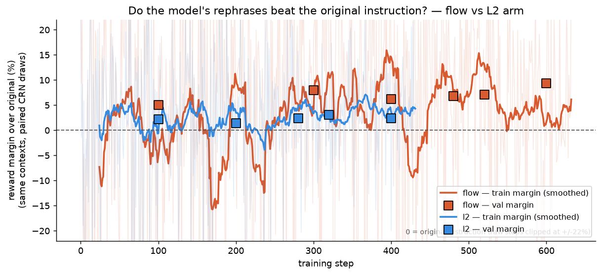

Per-arm details: [flow curves](results/charts/phase2_flow_curves.png) ·
[L2 curves](results/charts/phase2_l2_curves.png). Gate pass ~80%, parse
failures ~0, KL 0.5–0.75 throughout — the v1 failure signature is absent.

**What the model actually says — probes.** Every 25 steps each trainer greedily
answers the deployment prompt for 4 fixed task contexts. This is the clearest
window into what the reward is teaching:

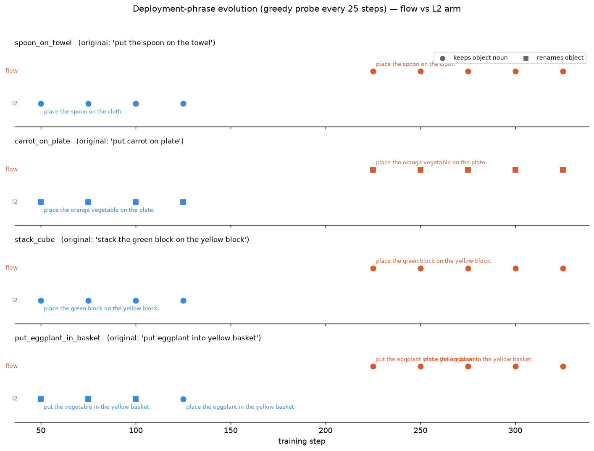

Two early signals, both on the rename axis (the reward-hacking direction 0c
identified): the **L2 arm un-learned an inherited rename** (eggplant:
"vegetable" → "eggplant", step 125) while the **flow arm keeps carrot renamed**
("orange vegetable", stable through 500). Consistent with the mechanism: a wrong
object changes the decoded *actions* (L2 punishes it) more reliably than it
changes the flow residual.

**First deployment eval (val states 0–9, 10 episodes/cell, ±16pp/cell).**
Greedy single phrase per task from each arm's best_val vs baselines:

| task | original | base Qwen | tuned_flow@300 | tuned_l2@100 |
|---|---|---|---|---|
| carrot | 40 | 50 | **30** | 40 |
| eggplant | 80 | 100 | 100 | 90 |
| spoon | 50 | 60 | 50 | 60 |
| stack | 30 | 30 | 40 | 40 |
| **overall** | **50.0** | **60.0** | 55.0 | 57.5 |

Honest reading: (1) *rephrasing helps* — every rephrase arm beats the original
instructions; (2) *the RL hasn't beaten its own base model yet* at these early
checkpoints — base's verbose, specific phrases win overall; (3) the flow arm's
carrot rename **costs real success** (30 vs 40), the first deployment-level
evidence of the rename hack; (4) n=10/cell — only original-vs-base approaches
significance. Next eval: CoVer's red-team instructions (their ERT phrases,
verbatim), 25 val states, both arms' fresher checkpoints.

## Red-team eval — the deployment story under CoVer's adversarial instructions

Inputs: CoVer's 4 ERT red-team phrases, verbatim (e.g. stack = "Arrange the lush
green element atop the yellowish-orange element."). Test-time path per
ALGORITHM.md: Gemini trace on the red-team phrase -> Qwen single greedy phrase ->
execute. 25 val states/cell, 400 episodes. (Our val protocol, not CoVer's exact
reset-seed/150-step one — that stays sealed for the final run.)

| task | redteam_direct | base | tuned_flow@300 | tuned_l2@100 |
|---|---|---|---|---|
| carrot | 40 | 48 | 36 | **44** |
| eggplant | 48 | 84 | 72 | 56 |
| spoon | 28 | 60 | 48 | 40 |
| stack | **0** | 12 | **32** | **32** |
| **overall** | **29.0** | **51.0** | **47.0** | **43.0** |

Findings:

1. **Red-teaming craters the policy** — 29% overall vs ~50% nominal, and stack
   goes to literally **0/25**. CoVer's premise replicates cleanly.
2. **Rephrasing rescues it**: +14 to +22 points. On the hardest input (stack),
   both tuned arms hit 32% where base manages 12% and direct gets 0% — the tuned
   canonicalization ("place/stack the green block on the yellow block") beats
   base's verbose paraphrase precisely where decoding matters most.
3. **A free noise calibration, and it matters**: the two tuned arms emitted
   IDENTICAL phrases for eggplant and spoon, yet scored 72 vs 56 and 48 vs 40 on
   the same 25 initial states — pi0's stochastic decoding alone produces
   8-16pp cell-level swings. So: cell differences under ~16pp are unreadable,
   and the apparent overall base > tuned gap (51 vs 47/43) is mostly carried by
   identical-phrase cells, i.e. noise. Repeats (CoVer runs 3) are mandatory for
   the final table.
4. **On the cells where the arms actually differ** (carrot + stack), L2 leads
   flow 76 vs 68 aggregate — and carrot repeats the rename story: L2 recovered
   "carrot" (44%) while flow said "orange vegetable" (36%).
5. Checkpoint mapping for any CoVer comparison: our policy is their
   "Inst. Aug." checkpoint, so their 44.0 row is the relevant baseline analog,
   not their 41.5 pi0 row (and our protocol differs — see EXPERIMENT.md).

## Phase 2 v3 — from scratch, standard-order batches (running)

v2 taught us three lessons: the v1-init biased the A/B toward flow (both arms
inherited flow-trained habits), 2-context updates were ~1/100th of standard RLHF
batch sizes, and the judge cost a full generation per context. v3 restarts BOTH
arms from base Qwen with the fixed recipe:

**The batch, precisely.** One training step = 6 contexts; each generates 32
candidates in one call (~28 survive dedupe); rewards are z-normalized within
each context's group (GRPO-style, group size ~28); the top-8 positive-advantage
candidates per context enter the loss. Gradients accumulate over 4 steps before
one optimizer step. So each weight update aggregates **24 contexts and up to 192
phrase-sequences** (~1,500-token multimodal prefix each, loss on phrase tokens
only) — in GRPO terms: 24 prompts x G=32 per update. v2 updated on ~15 sequences
from 2 contexts. No judge (drift watch moved to probes + rollout evals); flow
scoring at k=8 CRN draws (0b: reliability 0.93); lr 7e-6, beta_KL 0.15,
breaker at rolling KL 1.2. Step ~330s on the flow pod, ~250s on L2.

**Reward margins from scratch** ([chart](results/charts/reward_margin_v3.png)):
flow's vals run +13.7 -> +10.0 -> +6.6 -> +7.7% (an early spike while the
from-scratch candidate pool is wild, then settling near v2's PEAK — which v2
needed 3x the data to reach). L2 holds +2-3.5%, also at its v2 peak pace.

**Deployment (red-team) — the headline so far.** With the noise-calibrated
protocol (25 val states, x3-x6 repeats):

| arm | n | success % |
|---|---|---|
| redteam_direct (their pi0-baseline analog) | 300 | 30.7 |
| base_random (their "pi0 w/ random" analog) | 300 | 45.7 |
| base Qwen, greedy | 700 | 49.0 |
| tuned_flow v2 @300 / @680 | 300 ea | 43.0 / 45.3 |
| **tuned_flow v3 @40** | 300 | **50.0** |
| tuned_l2 (v2 and v3 checkpoints) | 300 ea | 39-42 |

The v3 flow arm **tied greedy-base after 40 from-scratch steps** — v2 never got
within 5 points. Greedy-base beats random-from-pool by ~3pp (selection matters
even untrained). The eval loop (pod 3) re-runs this table at x6 repeats for
every new best_val pair.

**Phrase evolution** ([chart](results/charts/probe_evolution_v3.png)): from
scratch, both arms start rename-heavy ("orange vegetable", "purple vegetable",
"yellow container"). The v2 divergence pattern is re-emerging on carrot: L2
recovers "carrot" by step 175 while flow keeps the rename — decoded-action
distance punishes wrong-object phrases that flow loss tolerates. Watch item:
flow's spoon phrase is inflating ("...on the table surface") — the no-judge
drift axis under surveillance.

## Eval robustness ledger — how much to trust each L2@280 number (2026-07-15)

Two headline claims about L2@280 look contradictory ("no better than base on the
training tasks" vs "only arm above original on unseen tasks"). Both stand; they
come from different eval generations with different strengths. The ledger, from
the banked artifacts:

| eval | inputs | tasks | n/arm | per-arm SE | L2@280 says |
|---|---|---|---|---|---|
| ID finalists ×24 (`rt_f40_l280`) | ERT red-team | 4 trained | 2,328 | ±1.0pp | 50.1% vs flow@40 48.7% |
| ID baselines ×6 (`rt_baselines`) | ERT red-team | 4 trained | 300–700 | ±1.9–2.9pp | base 49.0%, direct 30.7% |
| Val-task suite ×12 (`valtasks`) | nominal | 4 never-trained | 1,152 | ±1.3pp | 32.8 vs orig 28.3 / base 27.3 |

Findings:

1. **Episode count is no longer the binding constraint anywhere.** The ID
   red-team eval is actually our most-replicated number (n=2,328, SE 1pp) —
   *more* episodes per arm than the new val-task suite. On ID red-team inputs,
   L2@280 vs base is +1.1pp ± 2.2 → a genuine tie, not an under-powered one.
2. **Task-level variance is the binding constraint.** Per-task success spans
   22.9–51.7% (task SD ≈ 13pp) and both evals sample only 4 tasks. The val-task
   overall win is carried by ramekin (drop it: orig 33.9 / L2 34.1 / base 33.3 —
   a three-way tie). More reps cannot fix this; only more tasks can.
3. **Regime confound: no matched-methodology pair exists.** ID numbers are
   red-team-input; val-task numbers are nominal-input. "L2@280 ties base on
   trained tasks but wins on unseen tasks" compares across BOTH axes at once.
   Missing cells: nominal-input ID eval at matched ×12/5-arm methodology
   (queued, see below), ERT-input val-task eval (future).
4. **All deployed numbers are single-greedy-phrase numbers.** Zero sampling
   variance, but brittle: one token ("coke can"→"red can") moves a task 10–28pp.
   Beam-k phrase sets would quantify this axis.

**Fix queued 2026-07-15:** ID nominal mirror on pod 3 (behind the study queue) —
same 5 arms, 4 ID tasks, ×12 × 24 layouts (5,760 eps), exact val-task-suite
methodology. Completes the ID/val-task × nominal comparison with matched power.

**Bridge vocabulary check (2,250-episode instruction sample, 2026-07-15).**
"coke"/"pepsi"/"soda": 0 hits (cans appear only as "the can"/"small can"/one
"red can"). ramekin/keyboard/wheel/nut: 0. bowl: 88, plate: 108, towel: 85,
cloth: 406, pot: 535. Template "put X on": 332 vs "place X on": 82. Two
interpretation updates: (1) the coke-can-on-plate result (original "put coke can
on plate" 69.1% vs every rephraser's "red can" 41–59%) canNOT be Bridge-vocab
familiarity — "coke" isn't in Bridge; the binding must come from the VLM
pretraining prior (PaliGemma backbone), meaning π0's usable vocabulary is
Bridge-language ∪ web-prior, and brand-level names can bind *tighter* than color
descriptions. Rephrasers that "simplify" a name the prior already knows destroy
signal. (2) The ramekin win is confirmed as OOV→in-vocab translation: "ramekin"
(0 hits) → "ramekin bowl" ("bowl": 88 hits) is exactly mapping into the training
distribution's nouns.

## Next

- **Phase 2 (primary):** advantage-weighted tuning of Qwen3.5-9B from base, with
  the faithfulness-gated flow-loss reward. For a clean control, the tuned model and
  the frontier baseline share **CoVer's verbatim rephrase prompt** — the comparison
  isolates weights, not prompt design. Teacher-SFT warm-start and trace-conditioning
  as ablations.
- **Phase 4** remains the behavioral proof: roll out the *trained* generator in sim
  — all-in-sim, no domain confound.
- **Phase 1–2:** SFT + advantage-weighted tuning of Qwen3.5. Leaning toward
  RL-from-base-Qwen as the primary (cleaner claim: no frontier teacher), with
  teacher-distillation as an ablation.

## v5 — GRPO against the rollout-era reward, and the echo-Goodhart discovery (2026-07-13..17)

v5 ran two arms from scratch against the verifier reward: A = 16-list advantage-weighted,
B = GRPO sample-16. The headline chart looks like success — arm B's greedy deployment
phrase climbs from −0.35 to **+0.54 verifier logit**, crossing every baseline:

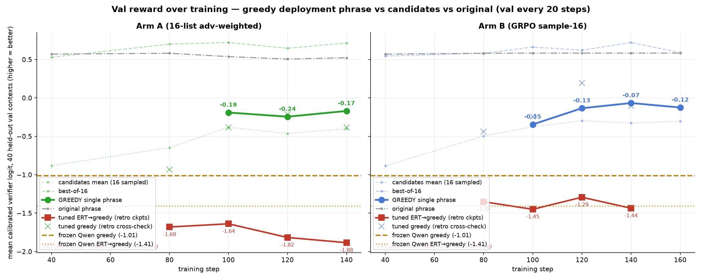

But look where B's blue line lands: it converges *into the gray original-phrase
reference*. A byte-level audit of the s260 checkpoint showed why — on all 7 clean
tasks the model **echoes the nominal input verbatim**. The reward had taught it that
the best rephrase of a training-distribution instruction is the instruction itself
(echo-Goodhart): the verifier scores GT-proximity, and identity is maximal proximity.
The 37.6% nominal ×12 headline of that era was later VOIDED (trace-misalignment bug +
echo + a mislabeled anchor — see the quarantine entry in EXPERIMENT.md); ex-bug, the
echoing checkpoint simply matched the originals battery (43.0 vs 42.6), as an echo must.

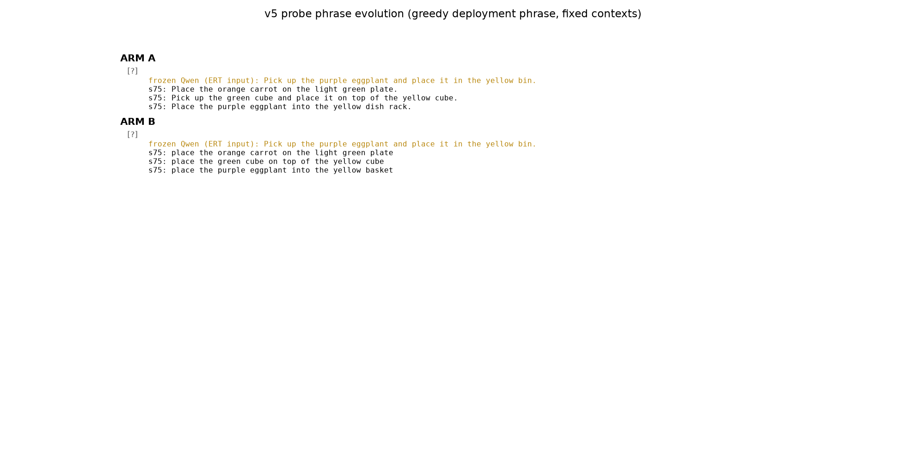

The phrase-evolution probe shows the drift toward training-register phrasing that
precedes full echo. v5's legacy is the mechanism insight that drove everything after:
**the reward is a GT-proximity detector**, so optimizing it converges the policy onto
the phrases π0 already knows — which cures nothing on hostile inputs and destroys the
rephraser on clean ones.

## v6 — hostile-majority tiers cure the echo; the reward's fine axis doesn't transfer (2026-07-17..18)

v6-B kept GRPO but restructured the inputs: stratified 2/2/4 tiers
(nominal / benign rephrase / hostile ERT-style sources), input dropout 1/3, tier tags
in the input slot from step 51, β=0.15, native-4f verifier reward. The echo died —
0/40 passthrough on every audit — and every verifier series climbed steadily:

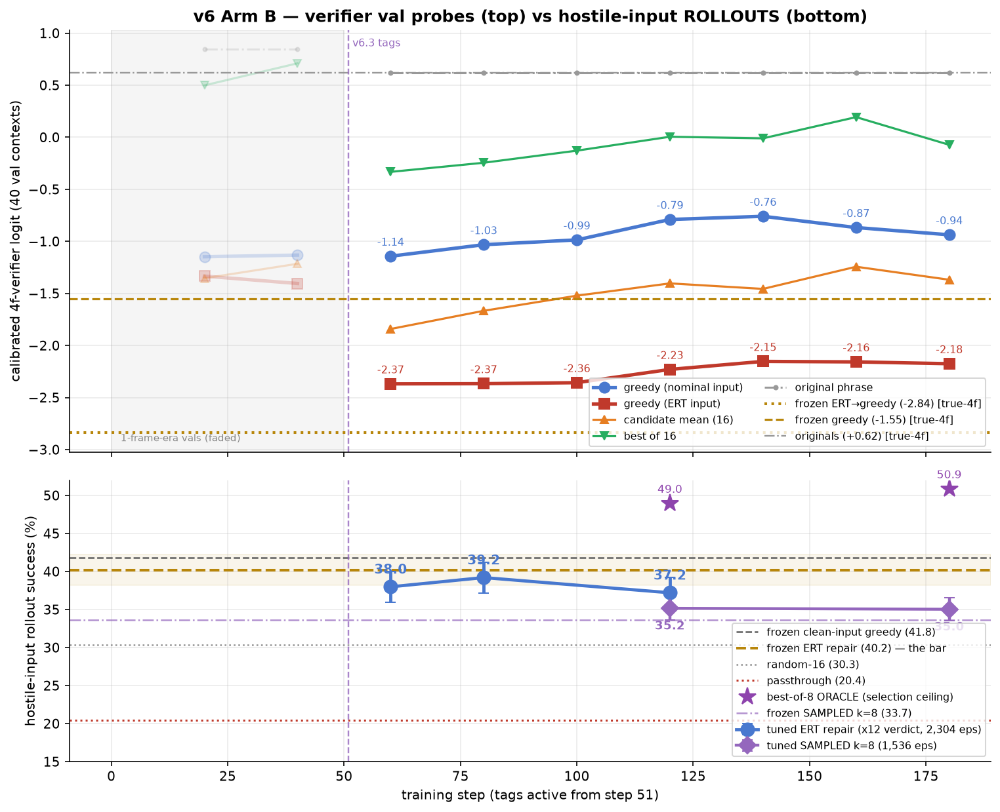

Rollouts refused to follow. Greedy ERT×12 stayed flat (37.2/39.2/37.2 at s80/120/160),
sampled k=8 flat (33.5–35.2 vs frozen 33.7, a paired tie), and the best-of-8 oracle
flat (~49–51%) — mode, distribution, and headroom all unresponsive while the reward
rose. The tracking chart makes the verdict visual — across checkpoints, ERT verifier
reward vs ERT rollout success correlates at **r = −0.93**:

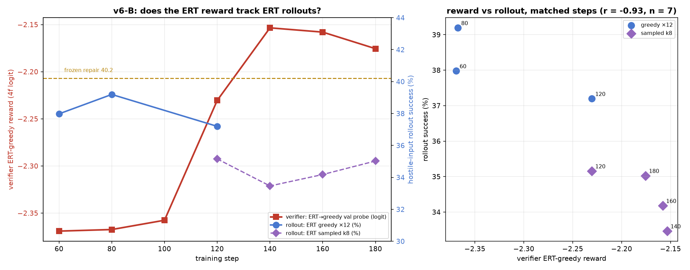

The mechanism was measured directly: tuned outputs converge toward Bridge GT wording
(token overlap 0.29→0.353 vs frozen 0.226, +0.134±0.027 paired, 5σ) while buying no
rollout points — GT-proximity again, now on the fine axis:

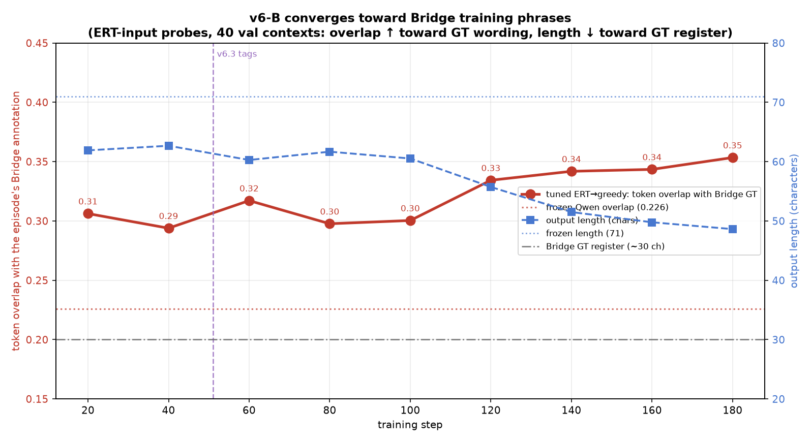

v6 ended at step ~192 on cost grounds with the negative primary verdict banked. Its
positive legacies: the echo cure (hostile-majority inputs), the diagnosis that the
reward's *fine* axis is the broken part (which the reward exams below then quantified),
and — later, once the frozen_gemini_trace anchor existed — the sharpened postmortem
that v6 RL finished *below* the frozen conditioning it was trained from (37–39 vs 40.5).

## Reward repair — the two exams behind v7's 25/75 blend (2026-07-18/19)

v6's flat rollout triptych against a climbing verifier reward (tracking r = −0.93)
demanded a reward audit before any v7. Two pre-registered exams compared the
production reward (the 4-frame verifier ensemble's logit, "C1") against rank-blends
of that logit with the action-chunk gripper error (grip-rank): 50/50 (C4a) and
25/75 logit/grip (C4b).

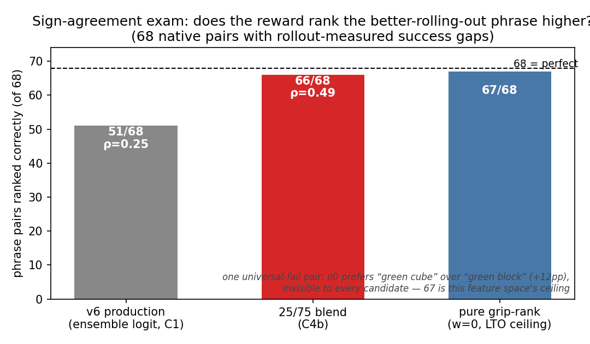

**Sign-agreement exam.** For 68 native-task phrase pairs whose true success gap was
measured by rollouts, we ask each candidate to rank the pair. The production reward
gets 51/68 (ρ = 0.25) — barely better than chance on the fine axis, consistent with
v6's failure to convert reward gains into rollout gains. The 25/75 blend gets 66/68
(ρ = 0.49); pure grip-rank reaches the 67/68 feature-space ceiling. One pair is
universally invisible: π0 prefers "green cube" over "green block" by +12pp and no
offline feature sees it. The fine signal lives in the gripper channel, not the flow
logit — which was anti-correlated on spoon.

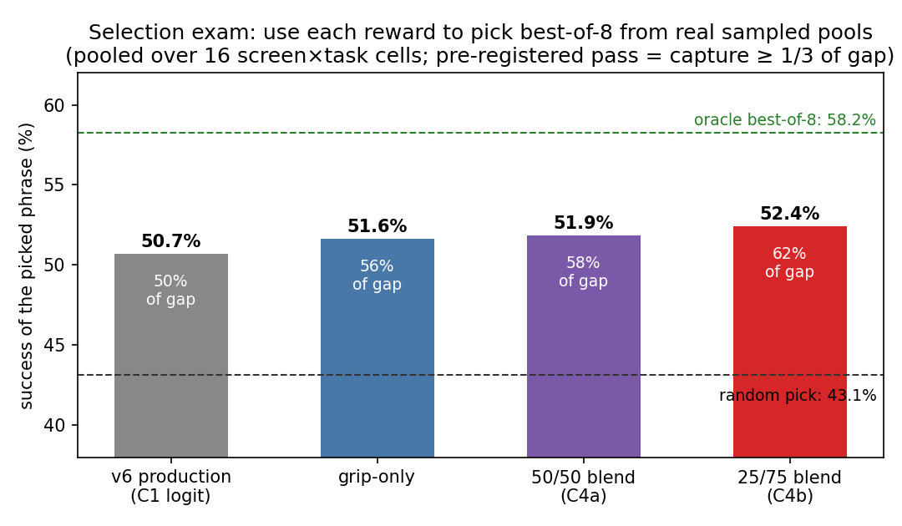

**Selection exam (the confirmation).** Higher-precision retest: use each reward to
pick the best of 8 real sampled phrases per task, score the pick's measured rollout
success, pooled over 16 cells. Random picking scores 43.1%, the oracle 58.2%. The
production reward captures 50% of that gap; 50/50 captures 58%; 25/75 captures 62%
(52.4%), passing the pre-registered ≥ 1/3 bar and topping the family. 25/75 was
chosen over pure grip for two-axis Goodhart resistance and grip's per-task
pathologies (carrot ρ = −0.12). This blend (rank-space, training advantages only)
is wired into the held v7 launcher.

## SFT-v1 — the dead-simple experiment: corrupt-and-invert beats RL's whole premise where vocabulary exists (2026-07-19..20)

The GT-proximity mechanism suggested skipping RL entirely: if π0 wants canonical
phrasing, *supervise* the mapping. SFT-v1 trains the same LoRA geometry as v6 on
73,304 text-only pairs — 51,296 hostile variants (frozen Qwen corrupting each of
17,297 unique train-split Bridge instructions in 3 ERT styles, spatial-goal-flip
filtered) plus ~22k benign pairs from the OXE paraphrase dictionary the INTACT π0
was actually finetuned with, everything mapping back to the canonical GT. Recipe
pre-committed (2 epochs, no checkpoint selection), eval attacks held out by
authorship (Gemini/CoVer-authored vs our Qwen-authored training corruptions).

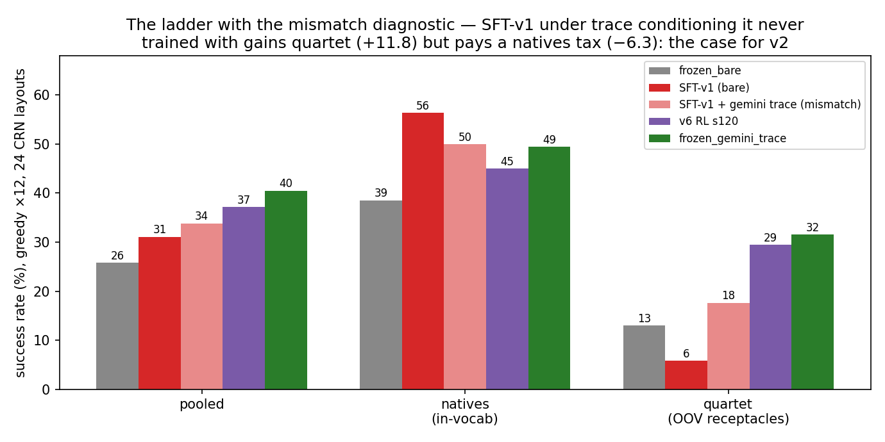

Bare-for-bare — identical no-reasoning wrapper, weights the only difference —
SFT-v1 beats frozen Qwen **+5.3±2.3pp paired** (31.1 vs 25.8, ×12 greedy), replicated
at +5.0±2.2 under sampling. The stratification is the finding: on in-vocabulary
tasks SFT hits **56.3% — the best natives number ever recorded on this suite**,
+9pp over the strongest v6 RL checkpoint and +7 over even frozen_gemini_trace.
On the OOV keeper quartet it collapses to 5.8: canonicalization *destroys* rich
descriptions when the true noun has no target in the vocabulary (ramekin→"the white
object" 3.8% where the frozen echo of the same description scores 42%;
keyboard→"mouse pad"). Sampling forensics split the failures: ramekin is a mode
artifact (SFT's own draws contain "white bowl" at 54%), keyboard/coke-plate are
distribution-deep (best-of-8 stuck at 8.3). Meanwhile frozen_gemini_trace (40.5)
proves image-grounded trace conditioning rescues exactly those tasks (quartet 31.5)
— and a probe showed the 9B resolves both OOV receptacles from the image on its own.
**The mismatch diagnostic (sft_gemini_trace).** Evaluating the v1 adapter under the
trace conditioning it never trained with completes the argument: pooled 33.8 —
quartet rescued halfway (+11.8 over its bare 5.8; coke-plate 5.9→30.9, ramekin
3.8→28.5, though keyboard stays at 1.4 where vocabulary-forcing still wins) but a
−6.3 *natives tax* (56.3→50.0) from the off-distribution prompt. A traceless-trained
model can partially read traces, and pays for the format shift exactly where it was
strongest. The v2 synthesis trains the reconstructor *with* Qwen self-traces: nouns from the
trace, relation from the input, register from the prior.
