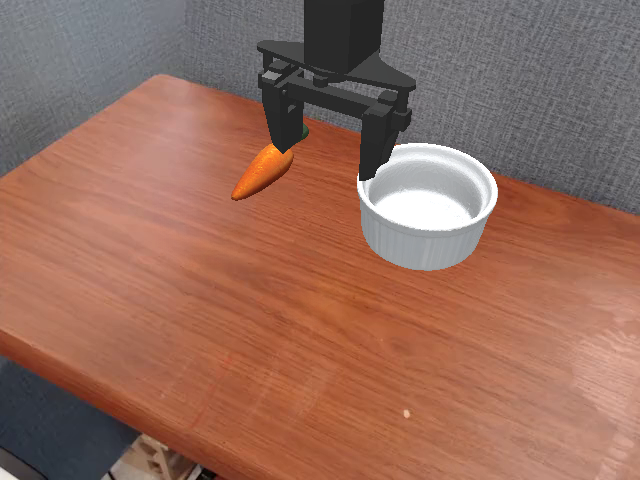
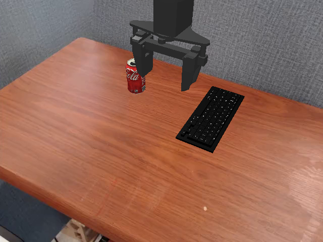
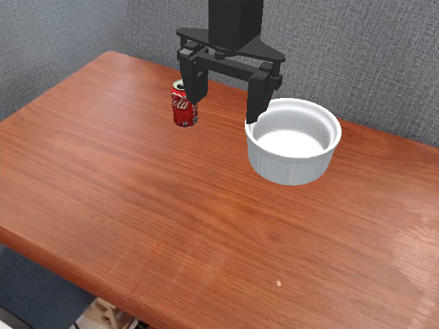
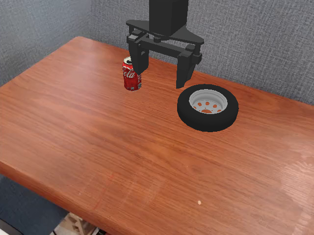
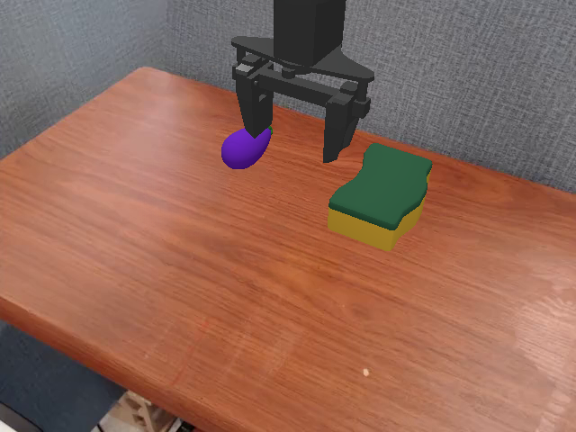
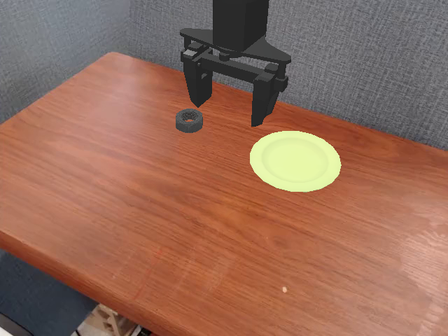
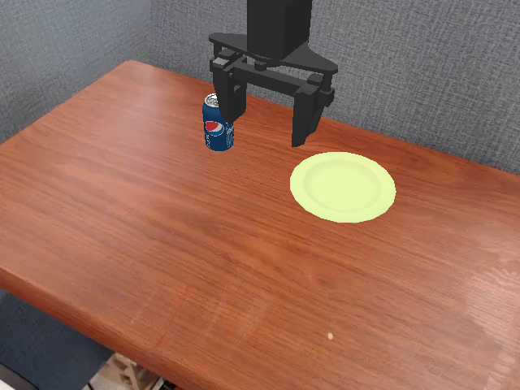

# Verified minimal pairs — full-grid re-roll (by task)

Frozen π₀ (rephrase-bridge) on SIMPLER; 6,912 episodes, full per-task layout grid × 3 reps (n=72; basket grid is 60 → n=180), layout id on every row, success = final state at the 60-step horizon.

Brackets are **Wilson 95% score intervals** on the success probability (≈ ±1.96 SE mid-range, asymmetric near 0/100%) — not ±1 SD. Only groups with a significant contrast (|z| ≥ 1.96) and phrases at full n are shown. **Bold** = the tokens that differ. Gap labels: LARGE ≥ 30pp, MEDIUM 15–30pp, SMALL < 15pp. ⚠ marks groups whose phrases also differ in capitalisation or trailing punctuation when that is NOT the tested edit (treat the gap as format-confounded by up to ~10-40pp until style-matched re-roll). Everything else: `pair_verdicts.csv`, `phrase_summary.csv`.

---

## carrot_on_keyboard

`carrot_on_keyboard_clean` — **MEDIUM gap (18pp)**

| phrase | success | n |
|---|---|---|
| **put** the carrot on the **black** **keyboard** | 25% [16–36] | 72 |
| **place** the carrot on the **keyboard** **keys** | 25% [16–36] | 72 |
| **place** the carrot on the **keyboard** | 15% [9–25] | 72 |
| **put** the carrot on the **keys** | 7% [3–15] | 72 |

---

## carrot_on_ramekin

`A06_prep_in_inside` — **MEDIUM gap (19pp)**

| phrase | success | n |
|---|---|---|
| Place the carrot **inside** the ramekin. | 40% [30–52] | 72 |
| Place the carrot **in** the ramekin. | 21% [13–32] | 72 |

`A16_noun_vegetable_carrot` — **LARGE gap (38pp)**

| phrase | success | n |
|---|---|---|
| Pick up the orange **carrot** and place it in the white bowl. | 47% [36–59] | 72 |
| Pick up the orange **vegetable** and place it in the white bowl. | 10% [5–19] | 72 |

---

## carrot_on_wheel

`carrot_on_wheel_clean` — **MEDIUM gap (25pp)**

| phrase | success | n |
|---|---|---|
| put the carrot on the **black** **wheel** | 31% [21–42] | 72 |
| put the carrot on the **wheel** | 12% [7–22] | 72 |
| put the carrot on the **rim** | 6% [2–13] | 72 |
| put the carrot on the **tire** | 6% [2–13] | 72 |

---

## coke_can_on_keyboard

`A15_noun_can_cylinder` — **LARGE gap (42pp)**

| phrase | success | n |
|---|---|---|
| Put the red soda **cylinder** on top of the black keyboard. | 46% [35–57] | 72 |
| Put the red soda **can** on top of the black keyboard. | 4% [1–12] | 72 |

`Rn1_can_coke` — **LARGE gap (32pp)**

| phrase | success | n |
|---|---|---|
| set the **coke** on top of the keyboard | 32% [22–43] | 72 |
| set the **can** on top of the keyboard | 0% [0–5] | 72 |

---

## coke_can_on_plate

`A17_noun_dish_plate` — **MEDIUM gap (19pp)**

| phrase | success | n |
|---|---|---|
| put the coke can on the **plate** | 61% [50–72] | 72 |
| put the coke can on the **dish** | 42% [31–53] | 72 |

`coke_can_on_plate_clean` — **LARGE gap (32pp)**

| phrase | success | n |
|---|---|---|
| put the **coke** on the **plate** | 67% [55–76] | 72 |
| put the **coke** **can** on the **plate** | 61% [50–72] | 72 |
| put the **coke** **can** on **top** **of** the **plate** | 53% [41–64] | 72 |
| put the **coke** **can** on the **yellow** **plate** | 44% [34–56] | 72 |
| put the **coke** **can** on the **dish** | 42% [31–53] | 72 |
| put the **can** on the **plate** | 35% [25–46] | 72 |

---

## coke_can_on_ramekin

`ramekin_ladder` — **LARGE gap (42pp)**

| phrase | success | n |
|---|---|---|
| place the red cola can inside the white **container** | 74% [62–82] | 72 |
| place the red cola can inside the white **basin** | 69% [58–79] | 72 |
| place the red cola can inside the white **bowl** | 69% [58–79] | 72 |
| place the red cola can inside the white **pot** | 69% [58–79] | 72 |
| place the red cola can inside the white **dish** | 51% [40–63] | 72 |
| place the red cola can inside the white **cup** | 50% [39–61] | 72 |
| place the red cola can inside the white **ramekin** | 32% [22–43] | 72 |

---

## coke_can_on_wheel

`Ac2_dest_black_wheel` — **MEDIUM gap (28pp)** · ⚠ not format-controlled

| phrase | success | n |
|---|---|---|
| **Grab** the red **Coke** can and set it on the **black** **wheel.** | 36% [26–48] | 72 |
| **grab** the red **coke** can and set it on the **wheel** | 8% [4–17] | 72 |

`Ac2m_dest_black_wheel_matched` — **MEDIUM gap (21pp)**

| phrase | success | n |
|---|---|---|
| grab the red coke can and set it on the **black** wheel | 29% [20–40] | 72 |
| grab the red coke can and set it on the wheel | 8% [4–17] | 72 |

---

## cube_on_plate

`A09_verb_put_place` — **LARGE gap (38pp)**

| phrase | success | n |
|---|---|---|
| **place** the green cube into the dish | 78% [67–86] | 72 |
| **put** the green cube into the dish | 40% [30–52] | 72 |

`Ac3_dest_yellow_plate` — **LARGE gap (30pp)** · ⚠ not format-controlled

| phrase | success | n |
|---|---|---|
| **Pick** up the green cube and put it on the **plate.** | 85% [75–91] | 72 |
| **pick** up the green cube and put it on the **yellow** **plate** | 54% [43–65] | 72 |

`Ac3m_dest_yellow_plate_matched` — **MEDIUM gap (22pp)**

| phrase | success | n |
|---|---|---|
| pick up the green cube and put it on the plate | 76% [65–85] | 72 |
| pick up the green cube and put it on the **yellow** plate | 54% [43–65] | 72 |

`Ac4_dest_green_plate_collision` — **MEDIUM gap (18pp)**

| phrase | success | n |
|---|---|---|
| Place the green block on the plate. | 82% [72–89] | 72 |
| Place the green block on the green plate. | 64% [52–74] | 72 |

`Ac6_obj_green_block` — **LARGE gap (35pp)**

| phrase | success | n |
|---|---|---|
| put the **green** block on the plate | 79% [68–87] | 72 |
| put the block on the plate | 44% [34–56] | 72 |

---

## eggplant_on_keyboard

`A12_verb_move_rest` — **MEDIUM gap (24pp)**

| phrase | success | n |
|---|---|---|
| **Rest** the purple eggplant on the black keyboard. | 40% [30–52] | 72 |
| **Move** the purple eggplant on the black keyboard. | 17% [10–27] | 72 |

`A19_articles` — **MEDIUM gap (19pp)**

| phrase | success | n |
|---|---|---|
| put eggplant on keyboard | 32% [22–43] | 72 |
| put **the** eggplant on **the** keyboard | 12% [7–22] | 72 |

`Ac1_dest_black_keyboard` — **LARGE gap (42pp)**

| phrase | success | n |
|---|---|---|
| put the eggplant on the **black** keyboard | 54% [43–65] | 72 |
| put the eggplant on the keyboard | 12% [7–22] | 72 |

`Ac9_obj_purple_on_colored_dest` — **LARGE gap (30pp)**

| phrase | success | n |
|---|---|---|
| The eggplant needs to end up on the black keyboard. | 61% [50–72] | 72 |
| The **purple** eggplant needs to end up on the black keyboard. | 31% [21–42] | 72 |

---

## eggplant_on_sponge

`A11_verb_move_set` — **MEDIUM gap (19pp)**

| phrase | success | n |
|---|---|---|
| **Set** the purple eggplant onto the sponge. | 88% [78–93] | 72 |
| **Move** the purple eggplant onto the sponge. | 68% [57–78] | 72 |

`A13_noun_thing_eggplant` — **LARGE gap (44pp)**

| phrase | success | n |
|---|---|---|
| set the purple **eggplant** on the yellow and green sponge | 71% [60–80] | 72 |
| set the purple **thing** on the yellow and green sponge | 26% [18–38] | 72 |

`A18_order_fronted` — **LARGE gap (49pp)** · ⚠ not format-controlled · *fronted word order — reads adversarial, not a benign edit*

| phrase | success | n |
|---|---|---|
| **Set** the purple **eggplant** on the sponge. | 85% [75–91] | 72 |
| purple **Eggplant** **set** on the sponge. | 36% [26–48] | 72 |

`Ac5_obj_purple_eggplant` — **LARGE gap (61pp)**

| phrase | success | n |
|---|---|---|
| **purple** eggplant goes on the sponge | 69% [58–79] | 72 |
| eggplant goes on the sponge | 8% [4–17] | 72 |

---

## nut_on_plate

`Ac8_obj_grey_nut` — **MEDIUM gap (18pp)**

| phrase | success | n |
|---|---|---|
| drop the nut on the yellow plate | 40% [30–52] | 72 |
| drop the **grey** nut on the yellow plate | 22% [14–33] | 72 |

---

## nut_on_wheel

`A08_verb_position_put` — **MEDIUM gap (17pp)**

| phrase | success | n |
|---|---|---|
| **Put** the nut right on the wheel. | 25% [16–36] | 72 |
| **Position** the nut right on the wheel. | 8% [4–17] | 72 |

---

## pepsi_on_plate

`A01_case_period` — **LARGE gap (43pp)** · *two format concepts (case + period); A02 isolates case*

| phrase | success | n |
|---|---|---|
| **set** the **pepsi** down on the **plate** | 69% [58–79] | 72 |
| **Set** the **Pepsi** down on the **plate.** | 26% [18–38] | 72 |

`A02_brand_case` — **LARGE gap (39pp)**

| phrase | success | n |
|---|---|---|
| **put** the **pepsi** on the **plate** | 69% [58–79] | 72 |
| **Put** the **Pepsi** on the **plate.** | 31% [21–42] | 72 |

`A07_prep_to_onto` — **MEDIUM gap (15pp)**

| phrase | success | n |
|---|---|---|
| Move the blue can **onto** the plate. | 36% [26–48] | 72 |
| Move the blue can **to** the plate. | 21% [13–32] | 72 |

`A14_noun_soda_pepsi` — **LARGE gap (39pp)**

| phrase | success | n |
|---|---|---|
| set the **pepsi** on the plate | 71% [60–80] | 72 |
| set the **soda** on the plate | 32% [22–43] | 72 |

`Ac7_obj_blue_coke` — **LARGE gap (38pp)**

| phrase | success | n |
|---|---|---|
| set the **blue** coke on the plate | 64% [52–74] | 72 |
| set the coke on the plate | 26% [18–38] | 72 |

---

## put_eggplant_in_basket

`put_eggplant_in_basket` — **SMALL gap (14pp)**

| phrase | success | n |
|---|---|---|
| put the eggplant in the **yellow** basket | 96% [92–98] | 180 |
| put the eggplant in the basket | 82% [75–87] | 180 |

---

## spoon_on_towel

`spoon_on_towel` — **MEDIUM gap (24pp)**

| phrase | success | n |
|---|---|---|
| put the spoon **atop** the towel | 67% [55–76] | 72 |
| put the spoon **on** the towel | 61% [50–72] | 72 |
| put the spoon **on** the **blue** towel | 44% [34–56] | 72 |
| put the spoon **atop** the **blue** towel | 43% [32–55] | 72 |

---

## stack_cube

`stack_cube` — **LARGE gap (33pp)**

| phrase | success | n |
|---|---|---|
| **put** **the** green **cube** on **the** yellow **cube** | 50% [39–61] | 72 |
| green **cube** on yellow **cube** | 43% [32–55] | 72 |
| **put** **the** green **block** on **the** yellow **block** | 29% [20–40] | 72 |
| **stack** **the** green **cube** on **the** yellow **cube** | 25% [16–36] | 72 |
| **stack** **the** green **block** on **the** yellow **block** | 21% [13–32] | 72 |
| green **block** on yellow **block** | 17% [10–27] | 72 |

---

Overall: **61 of 98** single-concept, format-matched contrasts survive at full-grid n (65/104 of all contrasts).
