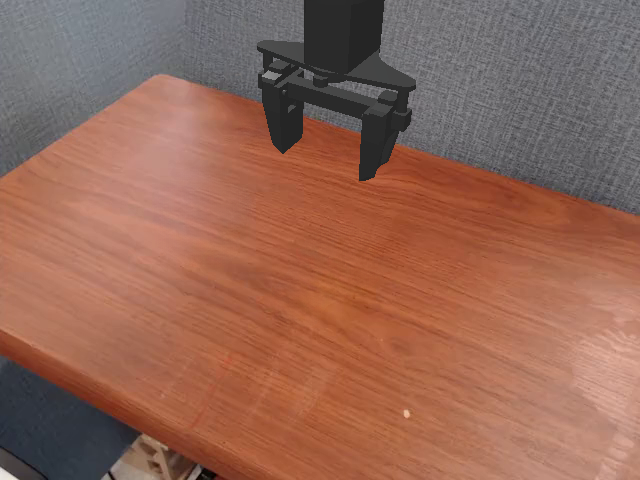
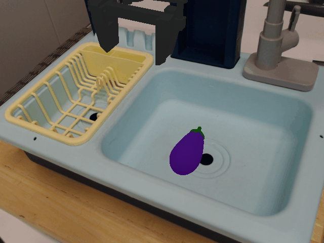

# Sim test-case cards: first frame + canonical + natural examples

## widowx_carrot_on_keyboard_clean

- **canonical**: put carrot on keyboard
- natural ex.: Move the orange vegetable onto the keyboard.
- natural ex.: put the orange carrot on the keyboard
- natural ex.: set the carrot on the black keyboard

## widowx_carrot_on_plate

- **canonical**: put carrot on plate
- natural ex.: Put the orange vegetable on the plate.
- natural ex.: set the carrot on the plate
- natural ex.: set the orange carrot on the plate

## widowx_carrot_on_wheel_clean

- **canonical**: put carrot on wheel
- natural ex.: Set that carrot on top of the wheel.
- natural ex.: set the carrot on the black tire
- natural ex.: set the carrot on the wheel

## widowx_coke_can_on_plate_clean

- **canonical**: put coke can on plate
- natural ex.: put the coke can on the yellow plate
- natural ex.: put the coke can on the plate.
- natural ex.: set coke can on plate

## widowx_coke_can_on_ramekin_clean

- **canonical**: put coke can on ramekin
- natural ex.: place the red cola can inside the white pot
- natural ex.: place the red cola can inside the ceramic bowl
- natural ex.: place the red cola can inside the white ramekin

## widowx_put_eggplant_in_basket

- **canonical**: put eggplant into yellow basket
- natural ex.: Grab that purple vegetable and drop it into the yellow basket.
- natural ex.: Load the eggplant into the yellow basket.
- natural ex.: Make sure the eggplant ends up in the yellow basket.

## widowx_spoon_on_towel

- **canonical**: put the spoon on the towel
- natural ex.: set the spoon down on the towel
- natural ex.: set the spoon on top of the towel
- natural ex.: Place the spoon onto the towel.

## widowx_stack_cube

- **canonical**: stack the green block on the yellow block
- natural ex.: Can you place the green block onto the yellow block for me?
- natural ex.: Bring the green block over to the yellow block and leave it on top.
- natural ex.: stack the green cube on top of the yellow cube
